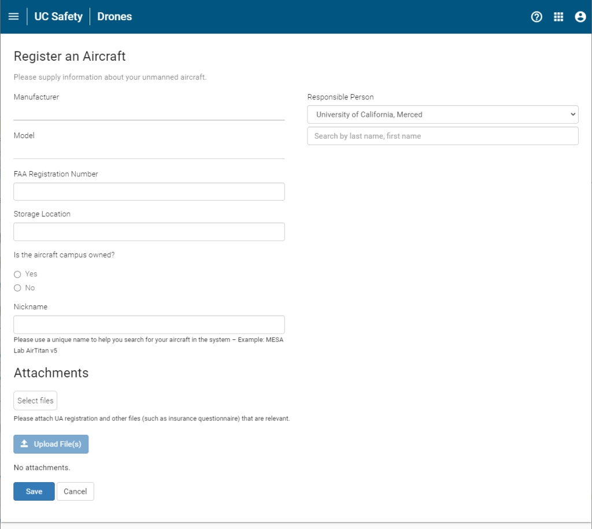

# Add your Drone to UC Drones {#ch-add-drone}

To register your drone with the UC system, add your drone to UC Drones.


## Manage Aircrafts {#manag-aircraft}

The Manage Aircrafts page lists all the drones registered with your campus.  From here, you can see the name, make/model, registration number as well as the Responsible Person for each drone.  

- While you can see each drone at your campus, only the Responsible Person may edit the properties, or view the additional properties of the drone.

```{r UCDrones-manage-aircrafts, fig.cap='UC Drones Manage Aircrafts', out.width='95%', fig.asp=.75, fig.align='center', echo=FALSE}
knitr::include_graphics('images/UCDrones_manage_drones.jpg')
```

## Add an Aircraft

To add an aircraft to the list, click on the yellow + button in the upper right corner of the Manage Aircraft's page (Figure \@ref(fig:UCDrones-manage-aircrafts))

On the Register an Aircraft Page, fill out the following information

```{r UCDrones-edit-aircrafts, fig.cap='UC Drones Add/Edit Aircraft', out.width='95%', fig.asp=.75, fig.align='center', echo=FALSE}

```

1. **Responsible Person**

    Search the campus directory for the person who is designated responsible for the management and updating of the drone's information within UC Drones.  This can be the regular pilot, administrative staff or PI.  This can be changed or updated at any time.
    
1. **Manufacturer**

    Enter the manufacturer of your drone.  If your drone is a kit build, use the name of the kit manufacturer.  If your drone is a custom-build, you may enter 'UC-Custom' or 'Personal-Custom' whichever is appropriate.
    
2. **Model**

    Enter the model name of your drone.  Please be sure to include any relevant suffixes (eg. Phantom 4 Pro V2)
    
3. **FAA Registration Number**

    All drones over 0.55 lbs and flown outside within the US must have an FAA registration number.  This number is a 10 digit alphanumeric code that starts with FA.  In some cases, it may also be an alphanumeric code that starts with N (N-number).  If the drone will exclusively be flown indoors or is under 0.55 lbs, enter the serial number (or an identifying number for a custom build).  There are special cases for UAS flown exclusively outside of the US - please contact us at UASsafety@ucmerced.edu for further instructions.
    
4. **Storage Location**

    Please enter the storage location of the aircraft, including building name and room number.  If the aircraft is not used for University business, this question may be ommitted.
    
5. **Campus Owned**

    Please select whether the aircraft is owned by the University (ie, purchased with campus funds, research funds, educational funds) or is personally-owned.
    
6. **Nickname**

    Enter a short nickname for your drone.  While your drone is searchable via the FAA registration number, you may also use a unique nickname to quickly find your drone while within the UC Drone web app.  We recommend sticking to a common naming scheme such as PI-Model-Number
    
7. **Attachments**

    You may attach additional files, such as the FAA registration pdf or purchase invoice, for easy retrieval.  Remember, for the UC UAS Replacement/Property insurance, we need to have a copy of the original purchase invoice so storing it here will make it easier to collect it.