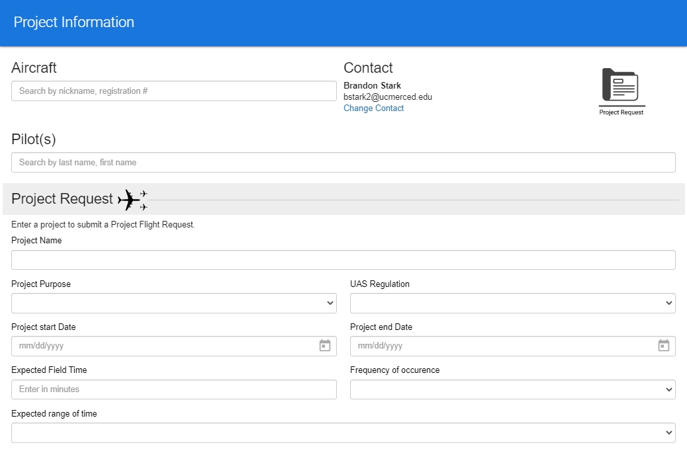
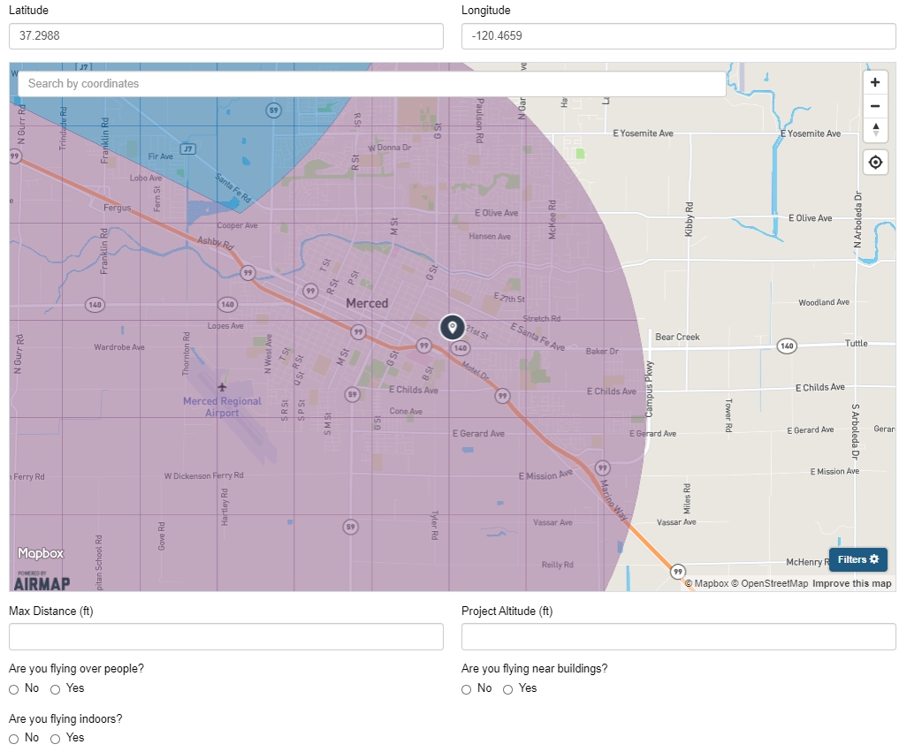
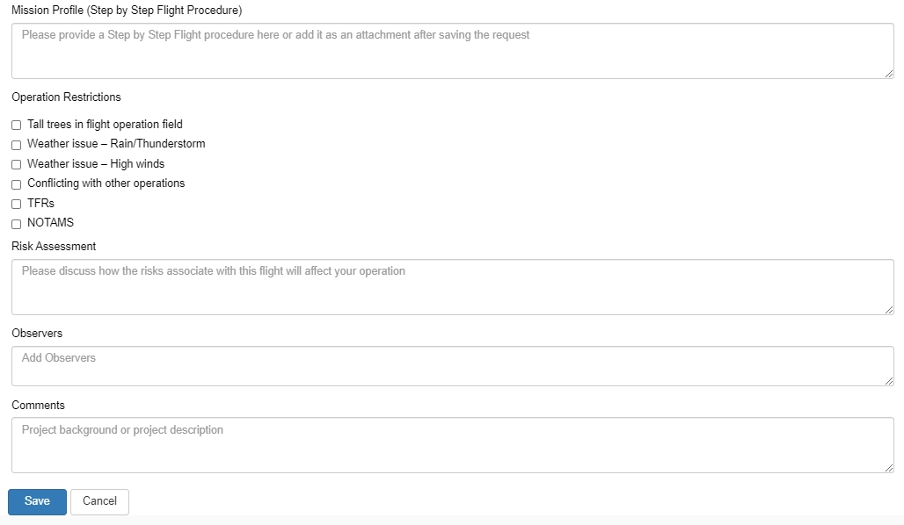
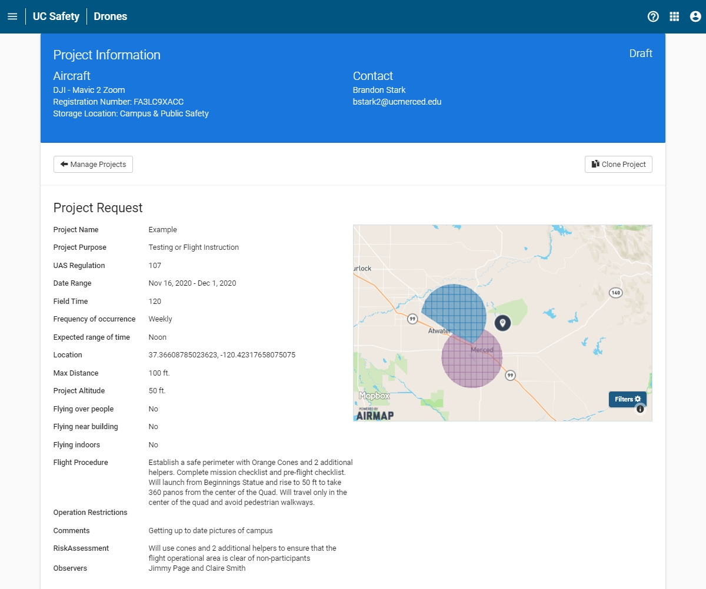
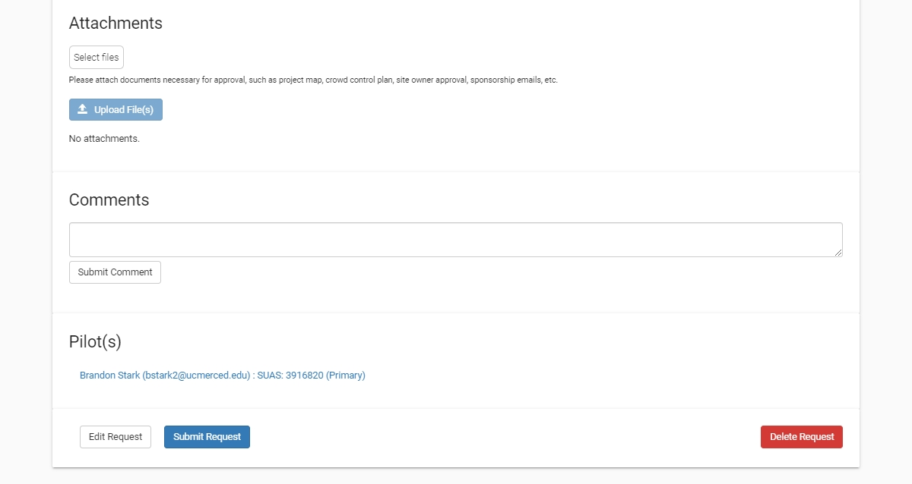

# Submitting a Flight Project {#ch-UCDrones-project}

A Flight Project comprises of multiple sets of UAS flights over defined period of time (up to 1 year) at a single area of operation per aircraft.  The Flight Project as a whole can be reviewed and approved within the app, rather than reviewing each flight.  All flight requests under an approved Flight Project are automatically approved and an email notice is sent to the local UAS Point of Contact. 

**Example Flight Projects**

-	Recurrent flight operations on field stations that do not require scheduling
-	Regular flight activity in access-controlled construction sites
-	Ad-hoc flights by NRS staff or researchers
-	Weekly flights on the user’s farm plots
-	A three-day workshop on campus where the location has been reserved

A Flight Project may not be edited once it has been approved.  A separate Flight Project must be submitted if a new pilot is desired.

## Manage Projects Page

The Manage Project page lists all of the Flight Projects that the user is listed as the Point of Contact or as one of the Pilots.  

```{r UCDrones-project, fig.cap='UC Drones Manage Projects', out.width='85%', fig.asp=.75, fig.align='center', echo=FALSE}
knitr::include_graphics('images/UCDrones_manage_project.jpg')
```

The list of projects is searchable by 

- Name of Project
- Name of Pilot, Point of Contact or Creator
- Status of Project Request: Draft, Pending Review, In Review, Request Reviewed, or Request Denied
- Date Range to Search (Project Begin Date - Project End Date)

Each project is listed with the Project Name, the project date range, status of Project request, point of contact, the number of pilots associated with the Project and the aircraft for the project.

## Project Request Form

To submit a Project request, go to the Manage Projects Page (Figure \@ref(fig:UCDrones-project)) and click on the yellow + (plus) button to go to the Project Information Page to start the request.

### Enter Project Information
The following interactive module provides a breakdown on how to fill out a Project Request.  The module requires a browser compatible with HTML5.  If you are having difficulty viewing the interactive module, please contact us at <UASsafety@ucmerced.edu>.

`r if (knitr::is_latex_output())'
Please visit the webpage for the interactive module on how to fill out a Project Request.
'`

```{r, include=knitr::is_html_output(excludes=c("epub")), echo=FALSE, out.width='100%'}
knitr::include_url("support/UCDroneProjectRequest/story.html", height="640px")
```

<!--### Old Info


```{r UCDrones-project-p1, fig.cap='UC Drones Project Request Part 1', out.width='95%', fig.asp=.75, fig.align='center', echo=FALSE}

```

1. **Enter Aircraft** 
    
    Enter either the Aircraft FAA registration number, or search by the Aircraft's nickname.  All aircraft at your campus will be visible, so ensure that you select the correct one.  Remember, only one aircraft is permitted per Project.  If you plan on flying on multiple aircraft, you have two options:
        - If you the other aircrafts are backup or alternate aircraft, go ahead and list their registration number in the comments.
        - If the aircraft are planned to fly in addition, such as if they are outfitted with different sensors (RGB vs Multispec), please file an additional project for each one.
    
2. **Enter Pilot(s)**

    Add all of the pilots you want to attach to the project.  During the flight notification, you will be able to select which pilot or pilots will be active for each outing. 
    
    After a project is created, pilots are not able to be added to the project.  You must submit a new Project to add pilots - use the Copy Project button to autofill the Project form.

3. **Change Contact (Optional)**

    If someone else should be the point of contact, you can click on 'Change Contact' to select any person in the Risk and Safety Solutions directory - which normally includes all faculty and staff at all UC campuses.  Search by name.
    
4. **Project Name (Optional)**

    Enter a name to give to the Project Request.  If no Project Name is provided, the Project Name will default to the name of the Contact Person.  
    
5. **Project Purpose**

    Enter the purpose of the project.  In some cases, the applicable set of UAS regulations may depend on the purpose.  Currently selectable options include: Aerospace Research, Agricultural Research, Building Inspection or Surveying, Coursework, Club activity or Recreation, Demonstration, Environmental Research, Filming for hte University or Publicity, General Engineering, Testing or Flight Instruction, Other - Research, Other.
    
6. **UAS Regulation (Optional)**

    Depending on the purpose, the most common set of applicable UAS regulations is selected, but may be adjusted if you know which set you will be operating under.  
    
7. **Project Start Date - Project End Date**

    Select the starting and ending date for your Project request.  When adding a flight to a project, UC Drones will limit submissions for only this range of dates.  If a project needs to be extended, please submit a new Project Request.
    
8. **Expected Field Time**

    Submit an estimate of how long each outing for flight missions will be.  
    
9. **Frequency of Occurrence**

    Select a rough estimate of how often flight operations in this project will be.  Selectable options include: Daily, Weekly or Monthly.

10. **Expected Range of Time**

    Select an approximate range of time for when flight operations in this project will be.  Selectable options include: Morning, Noon, Afternoon, Evening, All Day.

```{r UCDrones-project-p2, fig.cap='UC Drones Project Request Part 2', out.width='95%', fig.asp=.75, fig.align='center', echo=FALSE}

```

11. **Project Location**

    Use the map to select your flight location.  How accurate your location needs to be is dependent on your location.  If you are planning to fly at a specific location on a campus, such as the southwest corner of a quad, make sure the coordinates point to that location.  However, if you plan to fly at various locations at a UC Natural Reserve Site where there is no significant variation in location risk (ie, flying in one quadrant is the same as flying in another quadrant), then simply point the coordinates to the general flight area.
    
    If you are planning for multiple flights, you may attach an annotated map with the specific flight paths and your safety mitigation procedures.
    
    If you have multiple flight locations with a similar risk profile within the same area, the annotated map should include approximate launch/landing locations for each section.  
    
12. **Max Distance (ft)**

    Enter your anticipated maximum flight distance from UAS operator (lateral distance).  Small UAS such as the DJI Mavic Series typically should not be flown at distances greater than 1000 ft from the operator.  Larger UAS may maintain VLOS at distances of 3000-4000 ft.
    
13. **Project Altitude (ft)**

    Enter your anticipated maximum flight altitude (AGL)
    
14. **Situational Questions**

    Answer 'Yes' or 'No' to the following set of questions about flying over people, near buildings or if this request is for an indoor project.
    
```{r UCDrones-project-p3, fig.cap='UC Drones Project Request Part 3', out.width='95%', fig.asp=.75, fig.align='center', echo=FALSE}

```


15. **Mission Profile (optional)**

    Provide your step-by-step flight procedures (or include as an attachment).  Describe your planning and safety measures.  You can also check the UC Drone Resources page (https://ucdrones.github.io/ch-resources.html) for templates of Mission Planning and Mission Checklists.

16. **Operation Restrictions (optional)**

    Select which issues you expect to encounter during your flight operations.
    
17. **Risk Assessment (optional)**

    Provide your justification of the safety of your flight operations with respect to any potential safety issue that you have identified.  Common issues to address: non-participant safety, uncertain weather conditions, telephone poles or powerlines.
    
18. **Observers (optional)**

    Include the name of any visual observers or other supporting personnel that will be a part of the UAS flight operation.
    
19. **Comments (optional)**

    Add in any other information, such as the project background or description, that might be necessary for reviewing the safety of the flight operation.

### Attach Files

After entering the flight information, click on 'Save' to be taken to the submission page.  On this page, the Project request is listed as a "DRAFT" and you can review all of the information you have previously entered.  Take the time to make sure that your GPS location and Project dates are correct.

```{r UCDrones-project-draft, fig.cap='UC Drones Project Request Draft Page', out.width='95%', fig.asp=.75, fig.align='center', echo=FALSE}

```

In addition to reviewing your submitted information, you can also attach other files.

**Files to Attach**

- Detailed Flight Plans indicating launch/recovery locations and flight paths for complicated flight operations
- Copies of your groups Standard Operating Procedures or custom checklists
- Permits or documentation of proof of authorization to access the flight location for State Parks, Natural Reserves or private properties

```{r UCDrones-project-comments, fig.cap='UC Drones Project Request Attachments and Comments', out.width='95%', fig.asp=.75, fig.align='center', echo=FALSE}

```

To attach a file, click on "Select Files" to locate the file on your computer, then click "Upload Files" to upload it to the application.  Files that are selected but not uploaded will be deleted upon refreshing the page.

### Comments

Comments to and from the UAS Project reviewers can be added in the comments section at any time.  Both the UAS Project Reviewers and the Contact Person/Pilots will be notified by email whenever a comment is added to the Project Request.

-->

## Filing a Project Flight

On the Manage Project page, all approved projects will have a button to 'Add Flight.'  Clicking this button will direct the user to a file a Project Flight notification. This Flight notification will be mostly filled in already - the user will just need to select the date and time of the flight operation (selectable only within the project duration) and may modify the active Pilot (from the list of Project Pilots), or adjust the Risk Assessment, Observers and Comments sections.