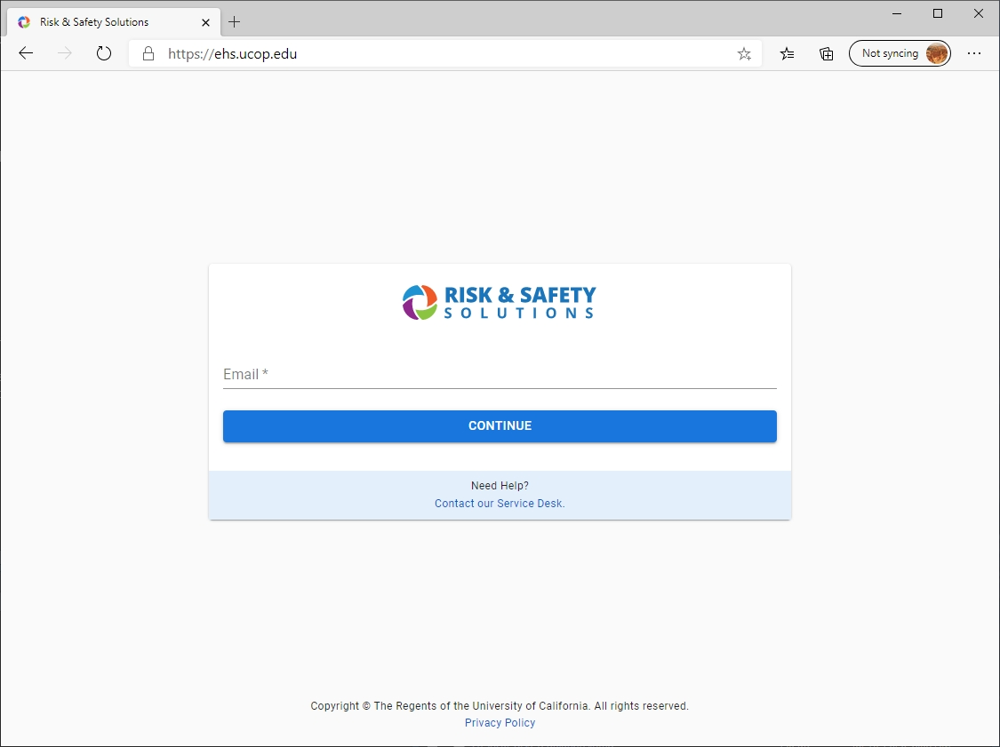
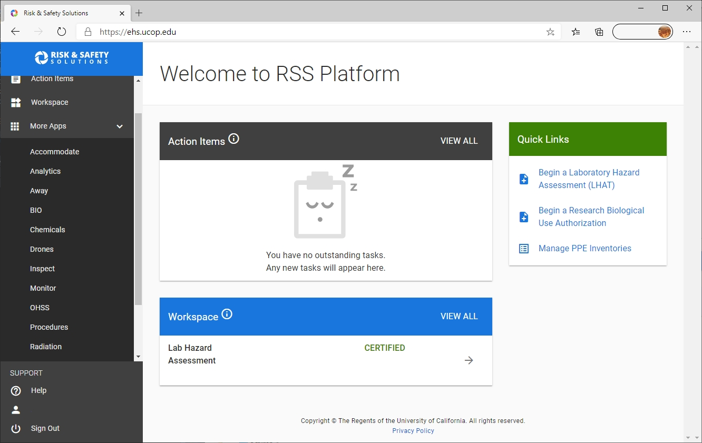

# Logging into UC Drones {#ch-UCdrones-login}

The UC Drones Web App is part of the UC Safety suite of apps for lab safety, occupational health and risk management. 

The UC Drones homepage can be found at http://ehs.ucop.edu/drones or through the Risk & Safety Solutions platform


1. The UC Safety suite of apps can be found at https://ehs.ucop.edu/

    ```{r rss-web, fig.cap='Risk and Safety Solutions Login', out.width='85%', fig.asp=.75, fig.align='center', echo=FALSE}

```
     
    1. The homepage will look similar to the image shown above:
    2. When you enter your campus email address, it will redirect you to your campus Single Sign On.
    3. Once logged in, you'll be taken to the RSS Platform Dashboard.  On the left, click on 'More Apps' and you'll find 'Drones' listed
    
    
```{r rss-dash, fig.cap='Risk and Safety Solutions Dashboard', out.width='85%', fig.asp=.75, fig.align='center', echo=FALSE}

```

 
2. You can login directly from http://ehs.ucop.edu/drones

    1. If you're not logged in already, you'll be redirected to login through your campus Single Sign On
    


