# UC Drones {#UCdrones}

[UC Drones](http://ehs.ucop.edu/drones) is a one-stop shop for drone oversight and management for the University of California system.  It is designed with the goal to develop a culture of safety and accountability in the use of drone by providing a unified portal for 1 ) enabling users be kept aware with regulatory compliance obligations, safety guidelines and best practices, 2) documenting drone activity through flight requests and reporting, and 3) tracking UC drone operations and safety metrics.

The use of [UC Drones Web App](http://ehs.ucop.edu/drones) is UC UAS Policy compliant. However, it is not the only means of UC UAS Policy compliance.  **If an alternative means of UC UAS Policy is needed or requested, please contact your campuses’ drone Point of Contact.**

<center>

[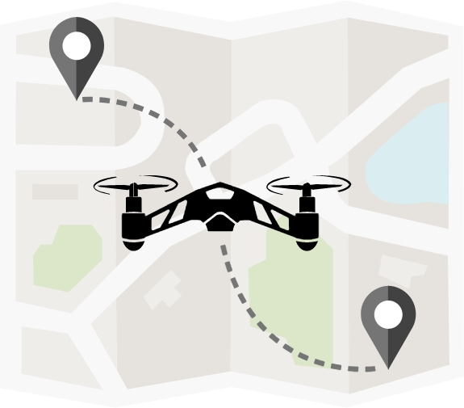](http://ehs.ucop.edu/drones){width=30px}

</center>

## Logging into UC Drones {#UCdrones-login}

The UC Drones Web App is part of the UC Safety suite of apps for lab safety, occupational health and risk management. 

The UC Drones homepage can be found at http://ehs.ucop.edu/drones or through the Risk & Safety Solutions platform


```{r rss-web, fig.cap='Risk and Safety Solutions Login', out.width='85%', fig.asp=.75, fig.align='center', echo=FALSE}
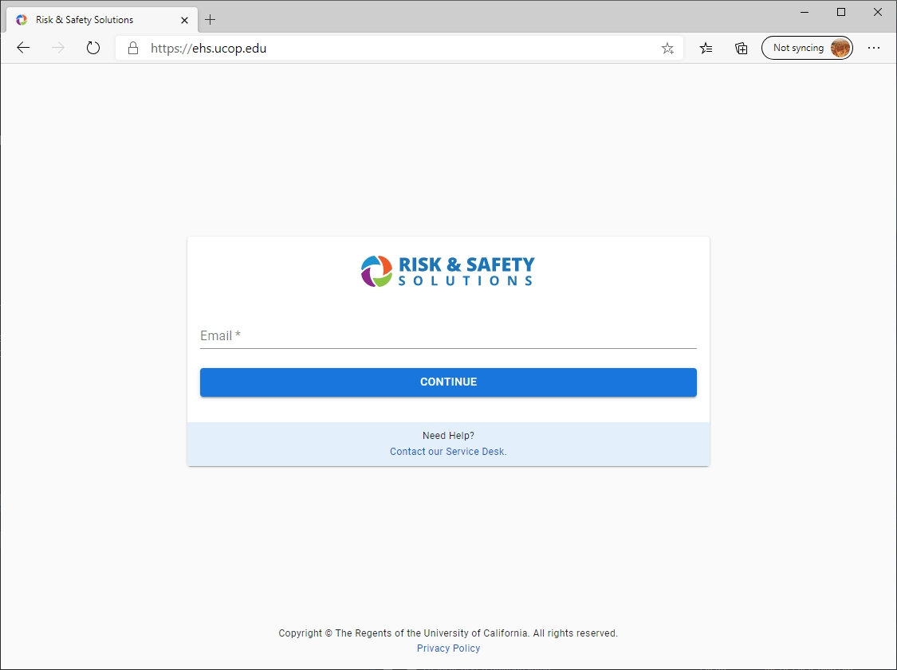
```
  
1. The UC Safety suite of apps can be found at https://ehs.ucop.edu/
    1. The homepage will look similar to the image shown above:
    2. When you enter your campus email address, it will redirect you to your campus Single Sign On.
    3. Once logged in, you'll be taken to the RSS Platform Dashboard.  On the left, click on 'More Apps' and you'll find 'Drones' listed
2. You can login directly from http://ehs.ucop.edu/drones
    1. If you're not logged in already, you'll be redirected to login through your campus Single Sign On
    
```{r rss-dash, fig.cap='Risk and Safety Solutions Dashboard', out.width='85%', fig.asp=.75, fig.align='center', echo=FALSE}
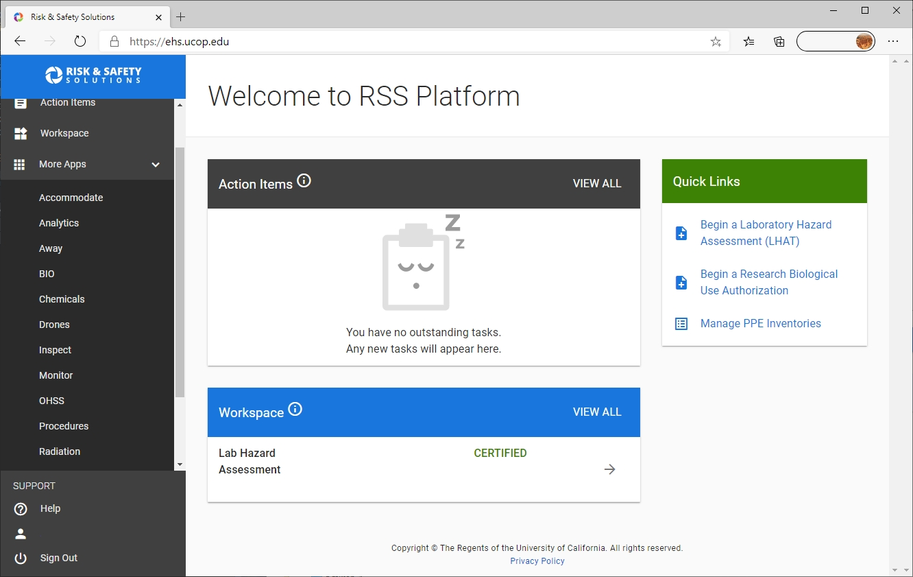
```


## UC Drone Home Page {#UCDrones-home}

The UC Drone Safety Home Page allows users to manage their drone flights, aircraft and their pilot information.  

```{r UCDrones-home, fig.cap='UC Drones Home Page', out.width='85%', fig.asp=.75, fig.align='center', echo=FALSE}
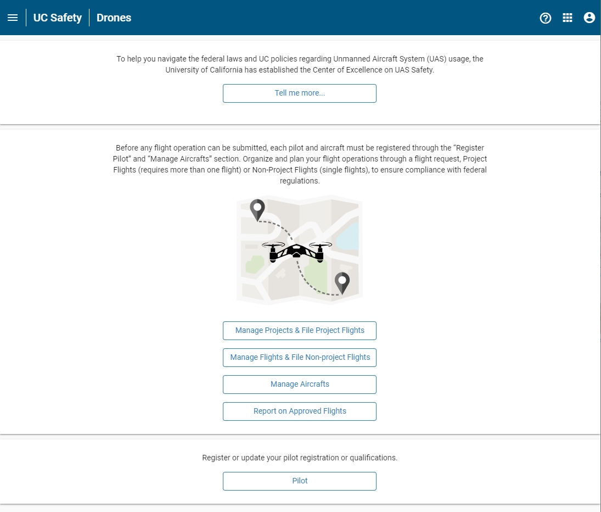
```

### Projects and Flights

Within UC Drones, you have two types of Requests available:

- Flight Projects
- Individual Flights

#### Flight Project

A Flight Project comprises of multiple sets of drone flights over defined period of time (up to 1 year) at a single area of operation.  The Flight Project as a whole can be reviewed and approved within the app, rather than reviewing each flight.  All flight requests under an approved Flight Project are automatically approved and an email notice is sent to the local drone Point of Contact. 

**Example Flight Projects**

-	Recurrent flight operations on field stations that do not require scheduling
-	Regular flight activity in access-controlled construction sites
-	Ad-hoc flights by NRS staff or researchers
-	Weekly flights on the user’s farm plots
-	A three-day workshop on campus where the location has been reserved

A Flight Project may not be edited once it has been approved.  A separate Flight Project must be submitted if a new pilot is desired.

#### Individual Flight Request

An individual Flight Request comprises of one or more drone flights on a single day. Each Flight Request is reviewed individually, typically to address local issues such as campus safety, scheduling or privacy concerns.

**Example Individual Flight Requests**

-	Any site that the field manager requires prior approval for scheduling or wildlife considerations
-	Athletic or recreational fields that require scheduling
-	On-campus public areas without additional mitigation protocols or safety hazard analysis.
-	Special operations – flying at night, flying above 400 ft AGL, etc

### Manage Aircrafts

The Manage Aircrafts page allows the user to add aircraft for use in the UC Drones web app or edit their existing aircraft.  All aircraft registered at a campus will be visible to all, but only the Responsible Person may edit the entry.

### Report on Approved Flights

The Report on Approved Flights page lists all of the Approved Flights that the user is listed as either a pilot or the point of contact.  The user can select any of the approved flights and Create a Post-Flight Report to complete the UC Drone Policy process.

### Pilot {#UCDrones-pilot}

The Pilot page allows the user to enter in their pilot information, including their certificate number and any additional certifications as attachements.


## Submitting a Flight Project {#UCDrones-project}

A Flight Project comprises of multiple sets of drone flights over defined period of time (up to 1 year) at a single area of operation per aircraft.  The Flight Project as a whole can be reviewed and approved within the app, rather than reviewing each flight.  All flight requests under an approved Flight Project are automatically approved and an email notice is sent to the local Drone Point of Contact. 

**Example Flight Projects**

-	Recurrent flight operations on field stations that do not require scheduling
-	Regular flight activity in access-controlled construction sites
-	Ad-hoc flights by NRS staff or researchers
-	Weekly flights on the user’s farm plots
-	A three-day workshop on campus where the location has been reserved

A Flight Project may not be edited once it has been approved.  A separate Flight Project must be submitted if a new pilot is desired.

### Manage Projects Page

The Manage Project page lists all of the Flight Projects that the user is listed as the Point of Contact or as one of the Pilots.  

```{r UCDrones-project, fig.cap='UC Drones Manage Projects', out.width='85%', fig.asp=.75, fig.align='center', echo=FALSE}
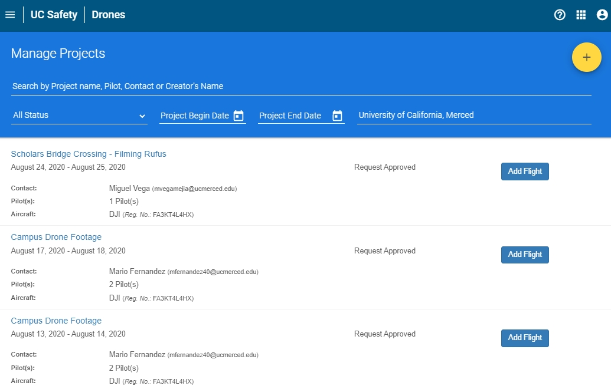
```

The list of projects is searchable by 

- Name of Project
- Name of Pilot, Point of Contact or Creator
- Status of Project Request: Draft, Pending Review, In Review, Request Reviewed, or Request Denied
- Date Range to Search (Project Begin Date - Project End Date)

Each project is listed with the Project Name, the project date range, status of Project request, point of contact, the number of pilots associated with the Project and the aircraft for the project.

### Project Request Form

To submit a Project request, go to the Manage Projects Page (Figure \@ref(fig:UCDrones-project)) and click on the yellow + (plus) button to go to the Project Information Page to start the request.

#### Enter Project Information
The following interactive module provides a breakdown on how to fill out a Project Request.  The module requires a browser compatible with HTML5.  If you are having difficulty viewing the interactive module, please contact us at <UASsafety@ucmerced.edu>.

`r if (knitr::is_latex_output()){"Please visit the webpage for the interactive module on how to fill out a Project Request.


1. **Enter Aircraft** 
    
    Enter either the Aircraft FAA registration number, or search by the Aircrafts nickname.  All aircraft at your campus will be visible, so ensure that you select the correct one.  Remember, only one aircraft is permitted per Project.  If you plan on flying on multiple aircraft, you have two options: 1) If you the other aircrafts are backup or alternate aircraft, go ahead and list their registration number in the comments. 2) If the aircraft are planned to fly in addition, such as if they are outfitted with different sensors (RGB vs Multispec), please file an additional project for each one.


    
2. **Enter Pilot(s)**

    Add all of the pilots you want to attach to the project.  During the flight notification, you will be able to select which pilot or pilots will be active for each outing. 
    
    After a project is created, pilots are not able to be added to the project.  You must submit a new Project to add pilots - use the Copy Project button to autofill the Project form.

3. **Change Contact (Optional)**

    If someone else should be the point of contact, you can click on 'Change Contact' to select any person in the Risk and Safety Solutions directory - which normally includes all faculty and staff at all UC campuses.  Search by name.
    
4. **Project Name (Optional)**

    Enter a name to give to the Project Request.  If no Project Name is provided, the Project Name will default to the name of the Contact Person.  
    
5. **Project Purpose**

    Enter the purpose of the project.  In some cases, the applicable set of drone regulations may depend on the purpose.  Currently selectable options include: Aerospace Research, Agricultural Research, Building Inspection or Surveying, Coursework, Club activity or Recreation, Demonstration, Environmental Research, Filming for hte University or Publicity, General Engineering, Testing or Flight Instruction, Other - Research, Other.
    
6. **UAS Regulation (Optional)**

    Depending on the purpose, the most common set of applicable drone regulations is selected, but may be adjusted if you know which set you will be operating under.  
    
7. **Project Start Date - Project End Date**

    Select the starting and ending date for your Project request.  When adding a flight to a project, UC Drones will limit submissions for only this range of dates.  If a project needs to be extended, please submit a new Project Request.
    
8. **Expected Field Time**

    Submit an estimate of how long each outing for flight missions will be.  
    
9. **Frequency of Occurrence**

    Select a rough estimate of how often flight operations in this project will be.  Selectable options include: Daily, Weekly or Monthly.
    
10. **Expected Range of Time**

    Select an approximate range of time for when flight operations in this project will be.  Selectable options include: Morning, Noon, Afternoon, Evening, All Day.

11. **Project Location**

    Use the map to select your flight location.  How accurate your location needs to be is dependent on your location.  If you are planning to fly at a specific location on a campus, such as the southwest corner of a quad, make sure the coordinates point to that location.  However, if you plan to fly at various locations at a UC Natural Reserve Site where there is no significant variation in location risk (ie, flying in one quadrant is the same as flying in another quadrant), then simply point the coordinates to the general flight area.
    
    If you are planning for multiple flights, you may attach an annotated map with the specific flight paths and your safety mitigation procedures.
    
    If you have multiple flight locations with a similar risk profile within the same area, the annotated map should include approximate launch/landing locations for each section.  
    
12. **Max Distance (ft)**

    Enter your anticipated maximum flight distance from drone operator (lateral distance).  Small drones such as the DJI Mavic Series typically should not be flown at distances greater than 1000 ft from the operator.  Larger drones may maintain VLOS at distances of 3000-4000 ft.
    
13. **Project Altitude (ft)**

    Enter your anticipated maximum flight altitude (AGL)

14. **Situational Questions**

    Answer 'Yes' or 'No' to the following set of questions about flying over people, near buildings or if this request is for an indoor project.
    
15. **Mission Profile (optional)**

    Provide your step-by-step flight procedures (or include as an attachment).  Describe your planning and safety measures.  You can also check the UC Drone Resources page (https://ucdrones.github.io/ch-resources.html) for templates of Mission Planning and Mission Checklists.

16. **Operation Restrictions (optional)**

    Select which issues you expect to encounter during your flight operations.
    
17. **Risk Assessment (optional)**

    Provide your justification of the safety of your flight operations with respect to any potential safety issue that you have identified.  Common issues to address: non-participant safety, uncertain weather conditions, telephone poles or powerlines.
    
18. **Observers (optional)**

    Include the name of any visual observers or other supporting personnel that will be a part of the drone flight operation.
    
19. **Comments (optional)**

    Add in any other information, such as the project background or description, that might be necessary for reviewing the safety of the flight operation.


**Attach Files**

After entering the flight information, click on 'Save' to be taken to the submission page.  On this page, the Project request is listed as a 'DRAFT' and you can review all of the information you have previously entered.  Take the time to make sure that your GPS location and Project dates are correct.

In addition to reviewing your submitted information, you can also attach other files.


**Files to Attach**

- Detailed Flight Plans indicating launch/recovery locations and flight paths for complicated flight operations
- Copies of your groups Standard Operating Procedures or custom checklists
- Permits or documentation of proof of authorization to access the flight location for State Parks, Natural Reserves or private properties

To attach a file, click on 'Select Files' to locate the file on your computer, then click 'Upload Files' to upload it to the application.  Files that are selected but not uploaded will be deleted upon refreshing the page.

**Comments**

Comments to and from the drone project reviewers can be added in the comments section at any time.  Both the drone project reviewers and the Contact Person/Pilots will be notified by email whenever a comment is added to the Project Request.

"}`

```{r, include=knitr::is_html_output(excludes=c("epub")), echo=FALSE, out.width='100%'}
knitr::include_url("support/UCDroneProjectRequestpg1/story.html", height="520px")
knitr::include_url("support/UCDroneProjectRequestpg2/story.html", height="667px")
knitr::include_url("support/UCDroneProjectRequestpg3/story.html", height="465px")
```

```{r, include=knitr::is_html_output(excludes=c("epub")), echo=FALSE, out.width='100%'}
knitr::include_url("support/UCDroneProjectRequestpg4/story.html", height="667px")
knitr::include_url("support/UCDroneProjectRequestpg5/story.html", height="450px")
```

### Filing a Project Flight

On the Manage Project page, all approved projects will have a button to **Add Flight** as seen in Figure \@ref(fig:UCDrones-project) or as in Figure \@ref(fig:UCDrones-project-flight-2).  Clicking this button will direct the user to a file a Project Flight notification. This Flight notification will be mostly filled in already - the user will just need to select the date and time of the flight operation (selectable only within the project duration) and may modify the active Pilot (from the list of Project Pilots), or adjust the Risk Assessment, Observers and Comments sections.

```{r UCDrones-project-flight-2, fig.cap='UC Drones Project Management', out.width='85%', fig.asp=.75, fig.align='center', echo=FALSE}
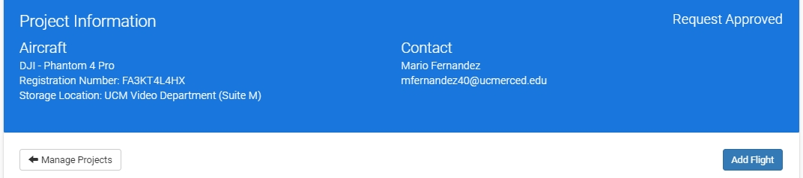
```

## Submitting a Flight Request

An individual Flight Request comprises of one or more drone flights on a single day. Each Flight Request is reviewed individually, typically to address local issues such as campus safety, scheduling or privacy concerns.

**Example Individual Flight Requests**

-	Any site that the field manager requires prior approval for scheduling or wildlife considerations
-	Athletic or recreational fields that require scheduling
-	On-campus public areas without additional mitigation protocols or safety hazard analysis.
-	Special operations – flying at night, flying above 400 ft AGL, etc

### Flight Request Form

The Flight Request form is nearly identical to the Project Request Form, except for 1 key difference.  Whereas the Project Request form asks for a date range, frequency of occurrence and expected range of time, the Flight Request form requests a specific date and time.  

When answering the specific date and time, be as specific as necessary.  If the location is time sensitive, such as a field reservation, or in between a busy time on campus, please specify the exact time.  But if the location does not have any time-related variation in safety, an approximate or estimate time is acceptable.

```{r UCDrones-flight-request, fig.cap='UC Drones Flight Request', out.width='85%', fig.asp=.75, fig.align='center', echo=FALSE}
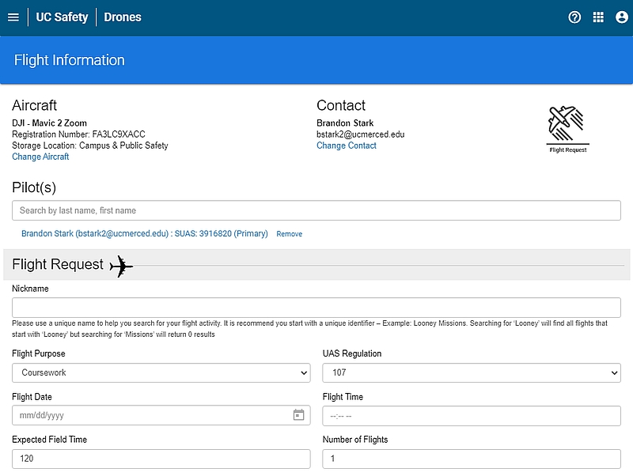
```

### Non-Project vs Project Flight

Both Projects and Non-Projects use the same Flight Request Form.  A Flight Request for a Project must be selected from the Project Page - either the Manage Projects Page and select 'Add Flight' (Figure \@ref(fig:UCDrones-project-flight-1)) or from the individual Project page and select 'Add Flight' under the header (\@ref(fig:UCDrones-project-flight-2)).

```{r UCDrones-project-flight-1, fig.cap='UC Drones Manage Projects', out.width='85%', fig.asp=.75, fig.align='center', echo=FALSE}

```


**Differences**

- A Flight Request for a Project is automatically approved upon submission
- A Flight Request for a Project is autofilled with the Project information
    - Only a handful of fields may be changed or completed


## Filing a Post-Flight Report {#UCDrones-post}

After each flight request, please make sure to file a post-flight report. You can find a list of all of your flights awaiting a post-flight report here: [Report on Approved Flights](https://ehs.ucop.edu/drones/flight?requestApproved=true) (requires log-in)

:::: {.notebox data-latex=""}
Make sure to click on **Add Flight** whenever you utilize a Project. Otherwise, your flights won't be listed for reporting. 
::::


Post-flight reports are a vital component to our drone safety management system. They help inform us of the overall flight activity within the UC system - monitoring trend lines of activity and anticipating future training needs.  The accident tracking helps us understand the rate of how often accidents occur and in which environments. Tracking our flight activity helps ensure our insurance coverage and keeps our rates low.


### Filing a Post-Flight Report

Find the flight that you wish to report on and enter it by clicking the the flight name. You can find a list of all of your flights awaiting a post-flight report here: [Report on Approved Flights](https://ehs.ucop.edu/drones/flight?requestApproved=true) (requires log-in)

At the bottom of your flight request, click on the **Create Report** button (Figure \@ref(fig:UCDrones-post-flight-1)).

```{r UCDrones-post-flight-1, fig.cap='UC Drones Create Report Button', out.width='85%', fig.asp=.75, fig.align='center', echo=FALSE}
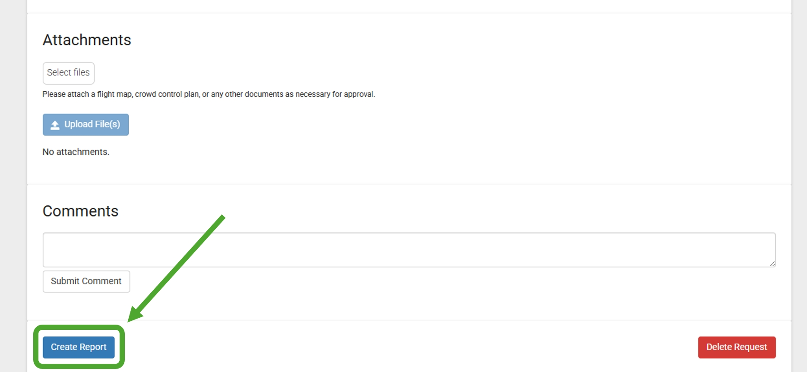
```

On the Flight Report page, fill out the following items:

1. **Duration per Flight** - On each row, list the minutes of each flight. For example, if you had three flights, you would list them as in Figure \@ref(fig:UCDrones-post-flight-2).

```{r UCDrones-post-flight-2, fig.cap='UC Drones Add Additional Flights', out.width='65%', fig.asp=.75, fig.align='center', echo=FALSE}
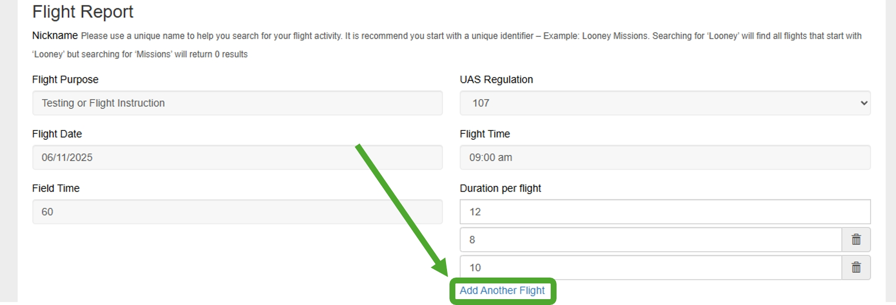
```

2. **Takeoff and Landing Damages** - Select whether the drone encountered damage while taking off or landing. If so, select the scale of the damage: minor damages, major, or total loss.

3. **Equipment Malfunctions** - If the drone suffered an equipment malfunction, select which component failed.

4. **Lost Link Events** - If the drone lost communication with the control station, pilot or other safety crew at any point (even temporarily), select the type of loss.

5. **Accidents/Mishaps** - If an accident or incident occurred, select one of the options (property damage, injury to non-participant, adverse wildlife, etc).

Once you have entered in the post-flight data, click on the **Save** button at the bottom (Figure \@ref(fig:UCDrones-post-flight-3)).

```{r UCDrones-post-flight-3, fig.cap='UC Drones Save Report', out.width='85%', fig.asp=.75, fig.align='center', echo=FALSE}
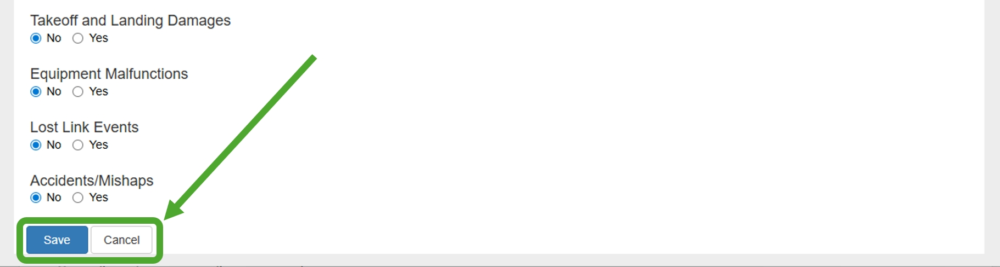
```

On the following page, review the information to ensure its accuracy. The first section will be the original Flight Request information, the second section will be your submitted Flight Report (Figure \@ref(fig:UCDrones-post-flight-4)), followed by the sections for Pilot(s), Attachments and Comments. 

```{r UCDrones-post-flight-4, fig.cap='UC Drones Review', out.width='85%', fig.asp=.75, fig.align='center', echo=FALSE}
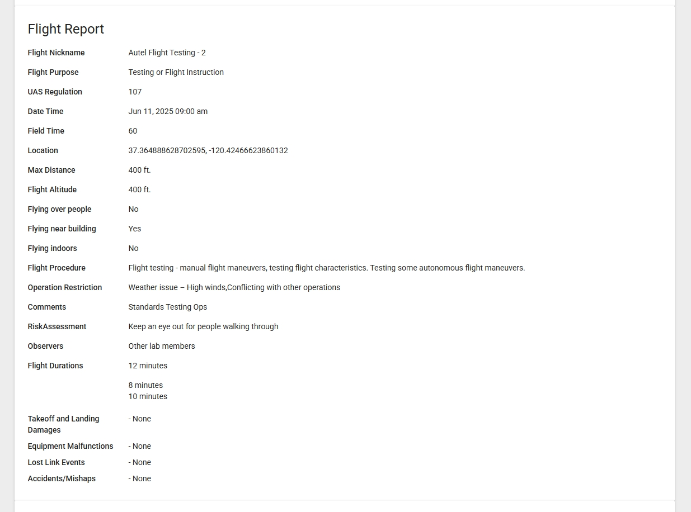
```

At the very bottom of the page, select the **Edit Report** to go back and make any changes, or **Submit Report** to complete the reporting process (Figure \@ref(fig:UCDrones-post-flight-5)).

```{r UCDrones-post-flight-5, fig.cap='UC Drones Submit Report', out.width='85%', fig.asp=.75, fig.align='center', echo=FALSE}
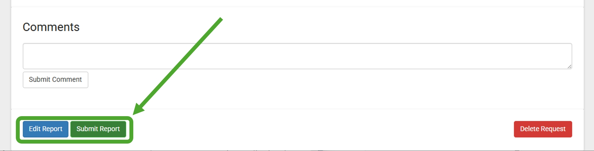
```


### Non-Punitive Reporting Statement

We strive to cultivate and foster a safety culture in which everyone is comfortable and encouraged to share safety concerns and reports of incidents with us. Every report is an opportunity to learn from our mistakes, share lessons learned and improve our overall safety. We ask that every operator accept the responsibility to communicate any information that may help improve not only their safety but the safety of all operators within the University of California. Reports may be filed through post-flight reporting, or through email to UASsafety@ucmerced.edu.

It is not the goal of the Policy to authorize the Systemwide Designated UAS Authority or Designated Local Authorities to seek out someone who has reported an error, accident, or mishap in order to administer disciplinary action for reporting. Upon the submission of a post-flight report describing an error, incident or accident related to UAS operations, the Systemwide Designated UAS Authority or Designated Local Authority may reach out to the reporter for followup and clarification. Reports of other issues, including those that ‘blow the whistle’ on illegal orders, will be handled in accordance with University policy as applicable, and prioritizing education over punishment whenever possible. Reporting does not shield the subject of the report from disciplinary actions of criminal or regulatory infractions.


## Add your Drone to UC Drones {#UCDrones-drone}

To register your drone with the UC system, add your drone to UC Drones.


### Manage Aircrafts {#manag-aircraft}

The Manage Aircrafts page lists all the drones registered with your campus.  From here, you can see the name, make/model, registration number as well as the Responsible Person for each drone.  

- While you can see each drone at your campus, only the Responsible Person may edit the properties, or view the additional properties of the drone.

```{r UCDrones-manage-aircrafts, fig.cap='UC Drones Manage Aircrafts', out.width='95%', fig.asp=.75, fig.align='center', echo=FALSE}
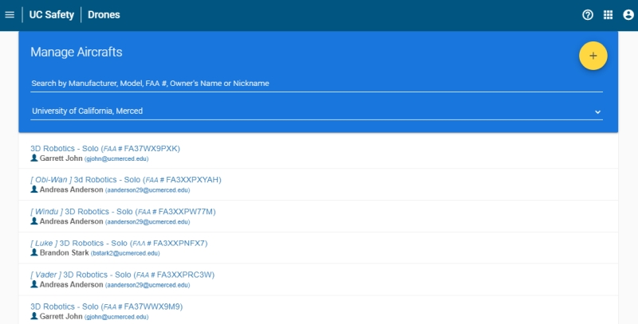
```

### Add an Aircraft

To add an aircraft to the list, click on the yellow + button in the upper right corner of the Manage Aircraft's page (Figure \@ref(fig:UCDrones-manage-aircrafts))

On the Register an Aircraft Page, fill out the following information

```{r UCDrones-edit-aircrafts, fig.cap='UC Drones Add/Edit Aircraft', out.width='95%', fig.asp=.75, fig.align='center', echo=FALSE}
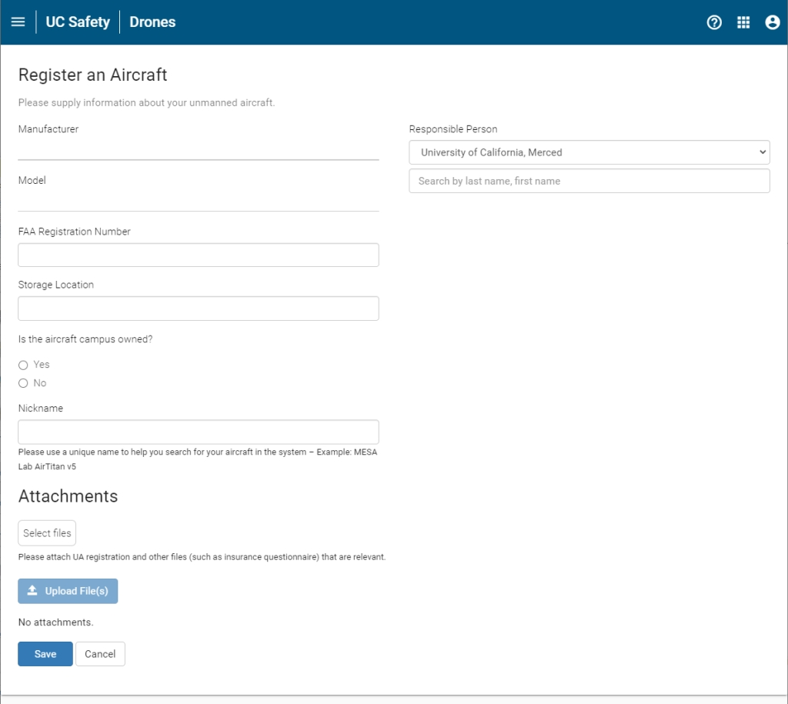
```

1. **Responsible Person**

    Search the campus directory for the person who is designated responsible for the management and updating of the drone's information within UC Drones.  This can be the regular pilot, administrative staff or PI.  This can be changed or updated at any time.
    
1. **Manufacturer**

    Enter the manufacturer of your drone.  If your drone is a kit build, use the name of the kit manufacturer.  If your drone is a custom-build, you may enter 'UC-Custom' or 'Personal-Custom' whichever is appropriate.
    
2. **Model**

    Enter the model name of your drone.  Please be sure to include any relevant suffixes (eg. Phantom 4 Pro V2)
    
3. **FAA Registration Number**

    All drones over 0.55 lbs and flown outside within the US must have an FAA registration number.  This number is a 10 digit alphanumeric code that starts with FA.  In some cases, it may also be an alphanumeric code that starts with N (N-number).  If the drone will exclusively be flown indoors or is under 0.55 lbs, enter the serial number (or an identifying number for a custom build).  There are special cases for drone flown exclusively outside of the US - please contact us at UASsafety@ucmerced.edu for further instructions.
    
4. **Storage Location**

    Please enter the storage location of the aircraft, including building name and room number.  If the aircraft is not used for University business, this question may be ommitted.
    
5. **Campus Owned**

    Please select whether the aircraft is owned by the University (ie, purchased with campus funds, research funds, educational funds) or is personally-owned.
    
6. **Nickname**

    Enter a short nickname for your drone.  While your drone is searchable via the FAA registration number, you may also use a unique nickname to quickly find your drone while within the UC Drone web app.  We recommend sticking to a common naming scheme such as PI-Model-Number
    
7. **Attachments**

    You may attach additional files, such as the FAA registration pdf or purchase invoice, for easy retrieval.  Remember, for the UC UAS Replacement/Property insurance, we need to have a copy of the original purchase invoice so storing it here will make it easier to collect it.
