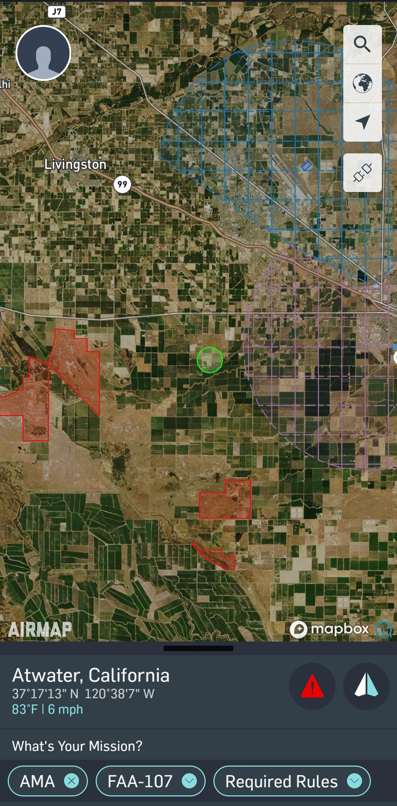

# How to get Airspace information {#ch-airspace-info}

When your figuring out where you want to fly, you're typically thinking about your research objectives on the ground.  But you must also think about whether or not it will be safe to fly a drone in the airspace at that location.  You won't find this information on Google Maps though - you need to check the Airspace Maps or Aviation Charts.

Reading an Airspace Map is not like reading Google Maps - you'll rarely see roads or buildings marked - instead you'll be presented with a whole new set of symbols and strange codes.  But they're all very important to convey a dense set of aviation information.  Luckily with drones, you won't have to worry about most of it, but there's still some very important pieces of information you need to know.

**Items to Learn about from an Airspace Map**

- Airspace Class
- Nearby Airports, including smaller ones
- Potential air traffic patterns
- 

## FAA Sectional Charts 

Getting information on a specific area's airspace classification has never been easier. The FAA has region specific sectional charts located [here](https://www.faa.gov/air_traffic/flight_info/aeronav/digital_products/vfr/). 


## Airmap WebApp


Apart from using these FAA provided resources, there are also several phone and web applications designed to make this an easy process. An example of one of these applications is Airmap. Airmap can be both as a webpage:


and as a mobile phone application for both IOS [IOS](https://apps.apple.com/us/app/airmap-for-drones/id1042824733) and [Android](https://play.google.com/store/apps/details?id=com.airmap.airmap&hl=en_US). It is important to know the classification of the airspace you are operating in. Being unsure or uninformed about your operating airspace can pose a safety hazard to both yourself and other pilots that maybe in the area.


```{r airmap, fig.cap='Android Airmap Application', out.width='50%', fig.asp=.75, fig.align='center', echo=FALSE}

```


Airmap not only gives you an interactive map showing a flight ceiling but it also allows you to plug in the type of operation you will be conducting (Part 107, recreational, AMA, etc) and get a corresponding list of rules and or requirements.

## The importance of up-to-date Airspace Information

Having the most up-to-date airspace information on hand can make all the difference between having a safe flight and a risky one. Cross referencing the information you have with a service such as the FAA's NOTAM search will allow you to stay in-the-know with the latest airspace information for a particular location.

## NOTAM or Notice To Airman

 

A NOTAM or Notice to Airman, is a notice that pertains to the establishment, change or condition of any facility, service or procedure of a specific location. The information is not known far enough in advance to be publicized by any other means therefore ensuring there are no active NOTAMS in the area you will be flying in is essential to the safety of yourself and others. It is important to keep in mind that NOTAMS can be put up at a moments notice.


