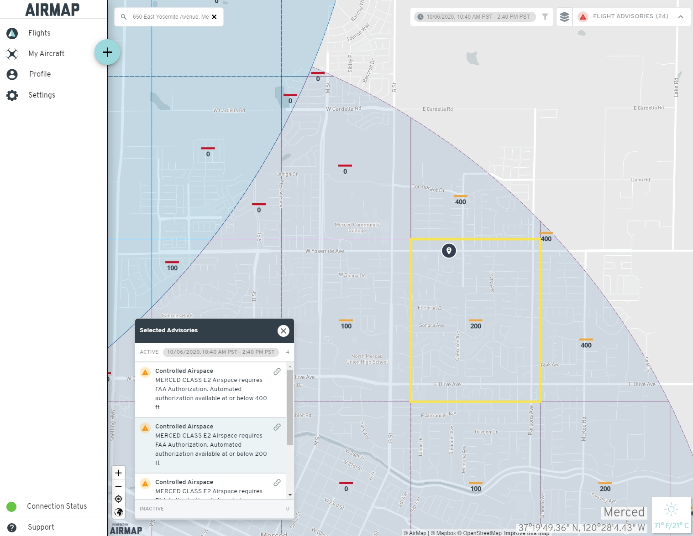

# Airspace information {#airspace-info}

When your figuring out where you want to fly, you're typically thinking about your research objectives on the ground.  But you must also think about whether or not it will be safe to fly a drone in the airspace at that location.  You won't find this information on Google Maps though - you need to check the Airspace Maps or Aviation Charts.  

Reading an Airspace Map is not like reading Google Maps - you'll rarely see roads or buildings marked - instead you'll be presented with a whole new set of symbols and strange codes.  But they're all very important to convey a dense set of aviation information.  Luckily with drones, you won't have to worry about most of it, but there's still some very important pieces of information you need to know.

:::: {.notebox data-latex=""}
There's a lot of rules about flying drones and many of them are related to where and how risky.  For more information about Airspace Class and their rules, check out the [Regulations](#regulations) and the Reading an Airspace Map pages.
::::

## What is Airspace?

The **Federal Aviation Administration** is in charge of making the rules and regulations for everyone in the United States flying above the ground. While the **National Airspace System (NAS)** does not have roads or streets like we have on the ground, there are a lot of rules about how to use the airspace correctly for the safety of others^[https://www.faa.gov/about/history/brief_history/].

### Airspace Classes

Since aviation works in 3 dimensions, so do the airspace rules.  Figure \@ref(fig:SUAS-airspace-airspace) gives a side profile of how the airspace is separated into different Classes.

```{r SUAS-airspace-airspace, fig.cap='Small UAS Airspace Rules', out.width='90%', fig.asp=.75, fig.align='center', echo=FALSE}
knitr::include_graphics('images/SUAS_airspace_map.jpg')
```

**Class A - Airlines**

Class A is not shown in Figure \@ref(fig:SUAS-airspace-airspace), but exists way up high between 18,000 ft and 60,000 ft above sea level - this is where commercial airliners fly and where our drones should not be. Flying up this high requires special coordination with Air Traffic Control to guide pilots to their destinations.

**Class B - Big Airports**

Class B airspace is found around the biggest airports in the country - including LAX and SFO. Every Class B airspace is individually tailored as needed to help guide aircraft around these busy areas.  This usually involves 2 or more different sized layers at different altitudes - imagine an aircraft taking off from a runway and staying in Class B airspace until it leaves the busiest areas.  Given the amount of air traffic around these airports, no one is allowed to fly in Class B airspace unless Air Traffic Control says its ok.  

**Class C - Common Airports**

Class C airspace is found around some of the more common regional airports, such as the Sacramento or Fresno airports.  They're busy areas, but not nearly as busy as the major airports, and so they don't need to control as much of the sky as them.

**Class D - Dinky Airports**

Class D airspace is found around small airports that don't have a lot of commercial airline traffic, mostly catering to private aviation use, such as the airports in Stockton or Palm Springs. But as with Class B and C airspace, no one is allowed to fly within Class D airspace without permission.

**Class E - the Everywhere Airspace**

Class E airspace is the other airspace that is not part of Class A, B, C, D or G airspace. Fun fact, there are 7 different classifications of Class E airspace.  But as a drone pilot, the most important consideration of Class E airspace is when your in the part of Class E airspace at the surface that is designated for an airport.  In that case, you'll also need to get permission to fly in that airspace.

**Class G - The Ground Airspace**

Class G airspace is the airspace at the ground - starting from the ground and going up to either 700 ft or 1200 ft above the ground, depending on location.  This is the only airspace that drones are allowed to fly in without getting prior permission. This is true even if you're near an airport. Very small airports, such as those for cropdusters or personal use, do exist in Class G airspace. Though they do not control the airspace near them, you should make sure you stay out of their way.


### What do you need to know?###

There's a lot of information to unpack when looking into airspace information.  As you try to figure out if your location will be safe, you'll want to look up:

- Airspace Class
- Nearby Airports, including smaller ones and helipads
- Potential air traffic patterns
- Special Use Airspace - Military Operating Areas, Controlled Firing Ranges, National Security Areas, and Restricted Areas
- Flying altitude limits within certain zones or grids
- Temporary Flight Restrictions or special alerts


## How to get Airspace Information


So where can you find this information?  We recommend two sources:

- Airmap (3rd party application and website)
- Official FAA Sources - VFR Sectional Charts, FAA Facility Maps, TFR/NOTAMs


### Airmap 

The most comprehensive and easy to use Drone airspace map system is [Airmap](https://app.airmap.com/).  Just type in your address or find your spot on the map, and see whats around you.  Airmap is available as both a webpage (Figure \@ref(fig:airmap-web)) and as an app for [iOS](https://apps.apple.com/us/app/airmap-for-drones/id1042824733) or [Android](https://play.google.com/store/apps/details?id=com.airmap.airmap&hl=en_US) (Figure \@ref(fig:airmap)).  

Once you find your flying spot on the map, you can evaluate many of the airspace issues you need to look for.  For example, in Figure \@ref(fig:airmap-web), the selected flying spot is within a grid box within the purple shaded region. 
The text box to the bottom left gives a brief explanation - the purple shaded region is MERCED CLASS E2 airspace - meaning that the location is located within the vicinity of the Merced Airport.  Any drone flying within any purple of blue shaded region will require permission from the FAA.  Class E2 is the least riskiest of the airport managed airspace (also known as controlled airspace), but still will have some airspace risk with occasional planes and helicopters flying above. 

```{r airmap-web, fig.cap='Android Airmap Application', out.width='85%', fig.asp=.75, fig.align='center', echo=FALSE}

```

For requesting permission to fly within a shaded region (controlled airspace), the FAA and the airports have drawn up grids within the shaded regions and labeled each one with a generally safe upper limit for flying.  Within the highlighted grid in Figure \@ref(fig:airmap-web), this limit is 200 ft.  If you ask the FAA for permission to fly up to 200 ft, you will always be given approval.  In general, the farther away you are from the runway, the higher the altitude you will be allowed to fly.  But that's not always the case - you'll notice, there are a couple of grids that are marked with a 0 - and yes, that means that the generally safe flying altitude is 0 ft.  

:::: {.notebox data-latex=""}
Need to get FAA permission to fly in one of these areas, head over [here](#LAANC)
::::
<br>

What if you need to fly higher than the altitude listed?  If you have a drone pilot license, you may ask the FAA for permission - but it is not guaranteed to be approved.  Obtaining permission for flights above the listed altitude can be tricky, so we recommend reaching out to us at UASsafety@ucmerced.edu and we'll be happy to walk you through the process.  Reach out to us early - the FAA can take 5-10 days to grant approval so you want to start this process early.

Airmap also does a good job of depicting other airspace issues, such as Special Use Airspace and National Security Areas - marked in red as in Figure \@ref(fig:airmap).  Selecting the AIRMAP Recommended Guidelines layer will also show all the helipads and minor airports that are not normally shown on an airspace map.  This can be critically important - low flying helicopters and cropdusters that fly out of these unmarked airports are among the most pressing airspace concerns. 

:::: {.notebox data-latex=""}
Make sure you click on the 'Layers' Icon next to the Flight Advisories - this allows you to turn on/off different information.  For most operations, we recommend selecting the following sets of information:

- FAA Part 107 Certified
- AIRMAP Recommend Guidelines
- Restricted and Special Use Airspace
- National Parks Public Use Limits
- NOAA Regulated Overflight Zones
- Fish and Wildlife Service Lands Use Limits
- Wilderness Areas Use Limits
::::
<br>
```{r airmap, fig.cap='Android Airmap Application', out.width='50%', fig.asp=.75, fig.align='center', echo=FALSE}
knitr::include_graphics('images/Airmap-Android.jpg')
```


### The importance of up-to-date Airspace Information

Having the most up-to-date airspace information on hand can make all the difference between having a safe flight and a risky one.  One of the advantages of Airmap is that it will also display a number of Temporary Flight Restrictions and Notices to Airman.  Especially in California, there are a number of these that we should always keep an eye on:

- **Disneyland** - Due to National Security Risks, the FAA has banned all aircraft from flying under 3000 ft within 3 miles of Disneyland.  This essentially also bans all drones in the area as well.    
- **Major League Baseball**, **National Football League** and **Division 1 College Football** Regular and Post-Season Games - Similarly to the Disneyland restriction, the FAA has banned all aircraft from flying under 3000 ft within 3 miles of any these games.  The ban starts at 1 hour before the games begin to 1 hour after the game ends.  
- **Wildfire and other Natural Disasters** - Whenever there is a major catastrophe, keep an eye out for Temporary Flight Restrictions.  These will often be very large and prolonged to allow emergency services (firefighting aircraft, medical support, etc) to have priority in these areas.  Never fly your drone in a manner that could interfere with emergency services - it is both a Federal offense and a State offense.  
- **US President and Vice-President Travel** - The President (30 mile) and Vice-President (5 mile) travel with their own FAA flight restriction zones, similarly prohibiting all aircraft from flying under 3000 ft within their zones.  

:::: {.notebox data-latex=""}
As with most drone related rules and regulations, there are nuances and exceptions to TFRs and NOTAMs.  If you have a pressing need to operate within a TFR, reach out to us at UASsafety@ucmerced.edu to discuss.
::::

### Official FAA Sources 

Using Airmap is one of the easiest methods for looking up most of the airspace issues.  However, it's not always the most detailed nor is it the official source of information.  The official sources of information is spread across a handful of different sites:

- Official source of airspace information - [FAA Sectional Charts](https://www.faa.gov/air_traffic/flight_info/aeronav/digital_products/vfr/)
- Official source of altitude grid information - [UAS Facility Maps](https://faa.maps.arcgis.com/apps/webappviewer/index.html?id=9c2e4406710048e19806ebf6a06754ad)
- Official source of TFR or NOTAMS - [FNS NOTAM Search](https://notams.aim.faa.gov/notamSearch/nsapp.html#/)

:::: {.notebox data-latex=""}
Always check multiple sources - you never know when one source omits an important piece of information.  For example, Figure \@ref(fig:facility-map) is the default view of Orange County of the UAS Facility Maps, but its doesn't depict one very critical flight restriction.
::::

#### FAA Sectional Charts


Getting information on a specific area's airspace classification has never been easier. The FAA has region specific sectional charts located [here](https://www.faa.gov/air_traffic/flight_info/aeronav/digital_products/vfr/). 

### UAS Facility Maps

```{r facility-map, fig.cap='UAS Facility Map', out.width='90%', fig.asp=.75, fig.align='center', echo=FALSE}

```

UAS Facility Maps show the maximum altitudes around airports where the FAA may authorize drone operations without additional safety analysis.  Grids marked in Green are LAANC (Low Altitude Authorization and Notification Capability) enabled - More on that in [LAANC Authorization](#ch-LAANC).

### NOTAM or Notice To Airman

 

A NOTAM or Notice to Airman, is a notice that pertains to the establishment, change or condition of any facility, service or procedure of a specific location. The information is not known far enough in advance to be publicized by any other means therefore ensuring there are no active NOTAMS in the area you will be flying in is essential to the safety of yourself and others. It is important to keep in mind that NOTAMS can be put up at a moments notice.


### Other Sources

Two other useful sources of information are [Skyvector](https://skyvector.com/) and the B4UFly App ([iOS](https://apps.apple.com/us/app/b4ufly/id992427109) and [Android](https://play.google.com/store/apps/details?id=gov.faa.b4ufly2&hl=en)).

#### SkyVector

```{r skyvector, fig.cap='SkyVector - VFR Chart viewer with TFRs', out.width='90%', fig.asp=.75, fig.align='center', echo=FALSE}
knitr::include_graphics('images/skyvector.jpg')
```

SkyVector is a manned aviation tool that allows users to view the FAA Sectional Charts (also known as VFR charts) as well as a wide range of other layers, including TFRs and IFR approaches.  While most of the information will be overwhelming for the beginning drone pilot, the basic VFR charts are still a great resource.

#### B4UFly App

The B4UFly App has been redesigned by Aloft (formerly kittyhawk.io) and now includes a lot of good information.  It also now includes an integration with the Aloft App to review FAA facility maps and file LAANC requests.

[B4UFly App](https://www.faa.gov/uas/recreational_fliers/where_can_i_fly/b4ufly/)

```{r b4ufly, fig.cap='B4UFly', out.width='50%', fig.asp=.75, fig.align='center', echo=FALSE}
knitr::include_graphics('images/B4UFLYlogo.jpg')
```

### Airspace Regulations

On this page, we're only looking at how to get the most basic of airspace information.  But obviously, there's a deeper level of knowledge to be studied when it comes to airspace regulations.  You'll find more information on the UAS Regulations and Learning About Airspace page, but for now, you can take a quick look at Figure \@ref(fig:SUAS-sim-regs) below.

```{r SUAS-sim-regs, fig.cap='Small UAS Airspace Rules', out.width='90%', fig.asp=.75, fig.align='center', echo=FALSE}
knitr::include_graphics('images/SUAS_airspace_map.jpg')
```


## LAANC Authorization {#LAANC}

In order to get FAA authorization to fly in controlled airspace, you typically will need to file a request through a system called "LAANC" (pronounced lance)

- If you plan on flying below the Facility Map altitude maximum, authorization will be instantaneous.
- If you want to request flying above the Facility Map altitude maximum, you'll need a Part 107 license and you'll need to make a safety case within your request.  Flight requests are automatically denied if they have not been resolved 24 hours prior to flight, so we recommend filing a request at least 1 week in advance.

### Using AirMap

One of our favorite programs to use for simple and free airspac authorizations is AirMap.  The process is relatively straightfoward.  Create an account, input your pilot and aircraft information, then find a place to fly.  Point to a spot on the map, draw a polygon or even just a line to describe your flight area then submit your flight plan.  It'll go straight to the FAA, or if manual approval by the tower is necessary, it'll go straight to the tower.  

For more information on how to use Airmap, check out their support information here:

[How to apply for Authorization](https://support.airmap.com/hc/en-us/articles/360030924511-How-to-apply-for-Authorization)


### Tips & Tricks

- **Need to draw a polygon using a satellite map?**

    Try this:
    - Go to https://geoman.io/geojson-editor and draw your polygon with satellite map on.  Export to a GeoJSON text file
    - Upload the GeoJSON file to Airmap using the ‘cloud’ button underneath the polygon.
    - The outline should now cover the right area and you file as normal

