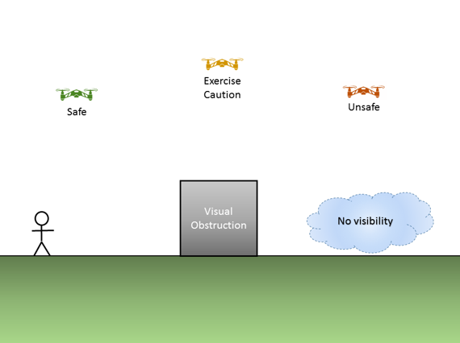

# (PART) More Details {-}

# Common UAS Regulation Violations {#ch-common-UAS-violations}

Unless given special permission by the FAA under Part 107 regulations, you are only allowed to operate 

 - Within Visual Line of Sight
 - Not Over People
 
Unfortunately, these are two of the most common UAS violations that we see, especially with videos on the internet.  Within the UC system, we are obligated to follow all applicable regulations. So even if you see someone else fly in violation of the laws, it's not ok for you to replicate it.
 
 
## Visual Line of Sight

Visual line of sight means that the pilot of the drone must be able to see the drone throughout the entire flight in order to

- know the drone's location
- determine the drone's attitude (orientation), altitude, and direction of flight
- observe the airspace for other air traffic or hazards
- determine that the drone does not endanger the life or property of another

The pilot must be **able** to do the above at all times, but doesn't have to be at all times - meaning he or she may glance at other objects, as long as the drone never leaves the pilot's ability to resume looking at the drone at any time.  

At any given time, at least the pilot or any visual observers must maintain visual line of sight - meaning while the pilot is looking away, there must be a visual observer to watch the drone during that time.

### A Speck in the Sky is not Sufficient

At all times, your drone must be close enough that you can tell which direction the drone is facing, how high it is and whether there are any hazards.  If all you can see of your drone is a small dot, it means you've gone too far.  In practice, your visual distance may be significantly impaired by trees or buildings in the horizon that may make it difficult to see the drone.  

Common Drones and recommended max visual distance (on a clear day in a rural location)

- **DJI Mavic Series** 900 ft horizontal distance
- **DJI Phantom Series** 1200 ft horizontal distance
- **DJI Matrice 600 Pro** 3000 ft horizontal distance
- **Fixed-wing (10ft wingspan)** 5000 ft horizontal distance

### You must be able to assess risk

If you can't see the sky around the drone or the ground below the drone as in Figure \@ref(fig:vlos), you're not within visual line of sight.  

```{r vlos, fig.cap='Visual Line of Sight', out.width='80%', fig.asp=.75, fig.align='center', echo=FALSE}

```

If this is a scenario that you're looking to do, you may be able to deploy a helper to assist to maintaining a clear flight operational area.  However, at no point is the drone allowed to be not viewable by the pilot.   

## Operations over Human Beings

Your drone is not allowed to be flown directly over people (107.39), or in a manner that poses a hazard to other people in the event of a loss of control of the drone for any reason (107.19(c)).  The combination of the two regulations form the majority of the restrictions around people.

You may only fly above people who are part of the immediate flight crew and whose tasks include ensuring flight safety.  It is not sufficient to provide spectators with personal protective equipment (PPE), or ask spectators to sign waivers.  

For more information about establishing effective safety buffers, see .