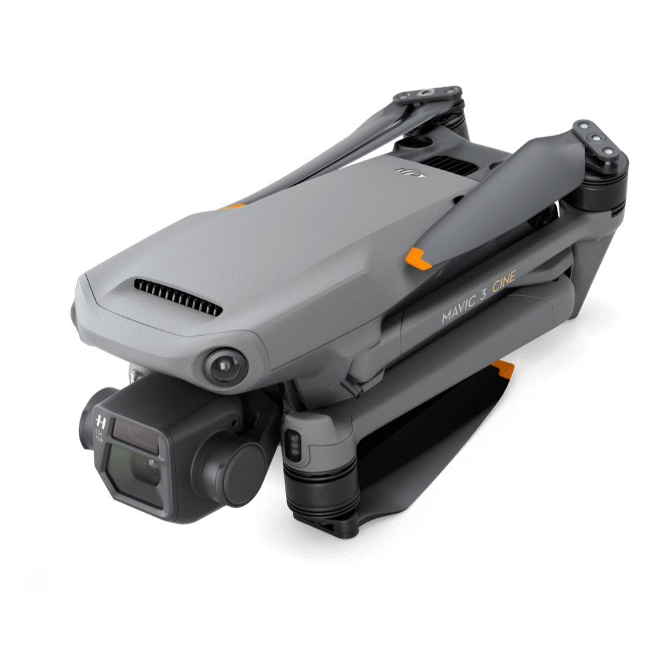

# Drones and Other Equipment

```{r drone3, fig.cap='The Mavic 3 is the newest model, but is it the best drone for you?', out.width='75%', fig.asp=.75, fig.align='center', echo=FALSE}

```

## What Drone should be get?


## Essential Supplemental Drone Equipment

As you build out your drone program, don't forget that you'll need more than just your drone.  Here is a list of our most useful supplemental drone equipment

**Sunshade** - A protective sunshade for your tablet or phone screen while flying a drone is a must-have.  Not only will this help you see your screen better in bright sunlight, it will also significantly reduce the risk of your tablet or phone overheating on those hot summer days.

**MicroSD cards** - Pick up the right microSD card for your drone.  High speed writing is key to ensuring you're getting all of your data.  At a minimum pick up an SD card with a V30 rating or above ([SanDisk Extreme 128GB U3/V30](https://www.amazon.com/SanDisk-Extreme-microSDXC-Memory-Adapter/dp/B07FCMKK5X?th=1)). V60 or above is prefered for 4K60fps ([Lexar 256 GB V60](https://www.amazon.com/Lexar-microSDXC-Professional-Adapter-Class10/dp/B09FJHMLC6/)).

**SD card holder** - At some point, you'll have an abundance of unlabeled microSD cards.  Keep yourself organized with this handy [microSD card holder](https://www.amazon.com/Holder-Storage-Organizer-Lightweight-Portable/dp/B07T6SWXK5/).  Small form factor and a spot to label each card will help keep you organized in the field. 

**Windmeter** - A handheld windmeter is another must-have when operating in the country.  We recommend a full weather meter such as the [Kestrel 2500 Weather Meter](https://kestrelmeters.com/collections/all-kestrel-meters/products/kestrel-2500-weather-meter) - this will provide wind, temperature and barometric pressure measurements.  Remember that most drones use a barometric pressure sensor to help with altitude measurements - by keeping track of the outside barometric pressure, you can determine whether your altitude measurement has drifted up or down during your flight.

**Wristband Playbook** - Pre-flight checklists are an important part of drone safety, but they don't have to be an easily lost sheet of paper on a clip board.  For regular operations or all-day affairs, we recommend using a [wristband playbook](https://www.amazon.com/dp/B01DJJW8QW) instead.  Place your checklist inside of the playbook and never lose it or forget it again.

**Whistle** - At some point you're going to need to communicate across the field. And when time is of the essence, there's no time to fumble with a radio.  A whistle is a great tool to have in the field. Any whistle will do, but we like these Whistles for Life Tri-Power Safety Whistle - [Purchase from Amazon ($10)](https://www.amazon.com/Whistles-Life-Tri-Power-Whistle-Snorkelers/dp/B004RRZIUO/) or bulk-purchase from [WhistlesforLife.com](https://whistlesforlife.com/)


