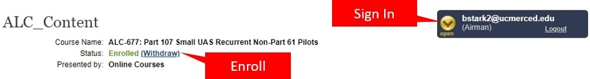
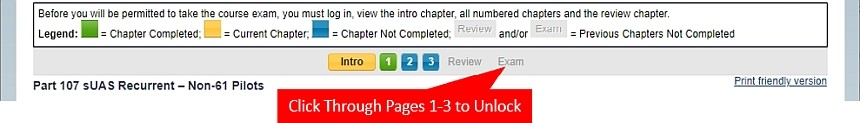
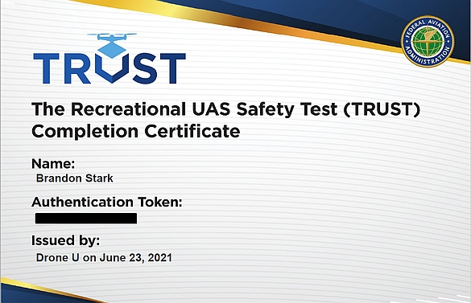

# FAA License Information {#license}

When operating a drone within the US, there are **two** different options for regulations: **Part 107 Small UAS regulations** or the **Exception for Limited Recreational Use**.  By default, UAS operations fall under Part 107 Small UAS regulations, unless you can meet the requirements for the exception for Recreational Use.  Part 107 requires that all pilots have a **Remote Pilot Certificate with an sUAS rating**, more commonly known as a 'Drone License,' whereas Recreational Use requires a **TRUST certificate**.

As of June 2021, **all drone pilots** must have either:

1. [Remote Pilot Certificate (Drone License)](#get-license)
2. [TRUST Certificate](#TRUST)

Many researchers opt to get a [Drone License](#get-license) for their research needs, but a Drone License does cost $150 and will take some time to study and prepare for.  With the updates introduced in the FAA Reauthorization Act of 2018 (P.L. 115-254), there are more exceptions available in which you may not need to obtain the license.

The [Recreational UAS Safety Test (TRUST) certificate](#TRUST) is a new requirement for all drone pilots without a Drone License.  The TRUST certificate is free for everyone, can be done online and takes 20-30 minutes to complete the training. You can obtain your TRUST certificate by completing the drone training at any of websites listed on the FAA's website here: https://www.faa.gov/uas/recreational_fliers/knowledge_test_updates/

:::: {.notebox data-latex=""}
This page is for the Federal Aviation Administration licensing requirements for UAS use.  UC Policy will still require a flight request and post flight reporting, regardless of FAA licensing requirements. More information on submitting flight requests can be found in Chapter \@ref(UCdrones).
::::

## Which should I Get? {#difference}

The Part 107 Remote Pilot Certificate, or Drone License, provides for the widest range of permissions and allowances. But there are many cases where a researcher may be satisfied with operating only under the Recreational Exception.  

But let's explain the difference between the two.

**Under Part 107** 
 
- Drone License required
- May fly for any purpose
- 'Fly only when it is safe'
  - The pilot is responsible for determining whether the environment and all conditions are safe for a drone flight. The pilot must their best judgment to assess whether the proposed flight operation will put anyone at risk. 
- May request special permissions
  - Above FAA Facility Map altitudes
  - Over People, BVLOS, More than 1 drone at a time
  
**Under Recreational Exception**

- TRUST certificate required
- May fly only for __Recreation or Approved Academic Activities__
- 'Fly only in safe locations'
  - The site has been designated by an organization, or is sufficiently clear and controlled, that this environment and location poses the least amount of risk to all participants. The pilot is still responsible for ensuring the safety of the flight, but the location is generally expected to be completely safe.
- No allowances for advanced operations
  - Must stick to the __basic rules__ for flight operations


Flight operations in **access controlled locations**, such as UC Reserves or agricultural field stations, are generally acceptable for the Recreational Exception.  The use of a **reserved campus field**, such as an Intramural Athletic Field or a Campus quad, may also be acceptable for the Recreational Exception as well.  


### Approved Academic Activities

You may not need a drone license if your flight operations can fit under the stipulations listed for 'recreational' activities **and** your flight operations are related to 

- Coursework
- Instruction of students
- Academic or research related uses of unmanned aircraft systems that have been approved by the institution
- Activities undertaken by the institution as part of research projects
- Other academic activities approved by the institution

Note that there is no restriction on **who** the approved academic activities can apply to. **Any person associated with the University undertaking the above academic activities are eligible**, this includes academic staff or academic support staff.  For example, a staff member at a UC Reserve may operate under the academic exception when conducting research activities.

:::: {.notebox data-latex=""}
However, not all UC activity is academic, even if it is for an academic group. For example, a student flying a drone to take pictures of the Engineering Hall for the Engineering Department is not considered academic.  
::::

### Simple Drone Regulations

Recreational flight operations, despite what you see on YouTube, have strict requirements:

- Only fly below 400 ft
- Must stay within Visual Line of Sight
- Must fly only in safe areas and no closer than 25 ft to any individuals
- Must use an established safety line to separate all operations from spectators and bystanders
- Must get FAA authorization to fly in Controlled Airspace (Class B, Class C, Class D and surface Class E)
- Never fly over any person or moving vehicle
- Never interfere with any manned aircraft or emergency response activity
- Never fly under the influence of drugs or alcohol
- Never operate in a careless or reckless manner

In many cases, these regulations are not that restrictive.  For research activities in a controlled location, such as an agricultural field station or a natural reserve, it is often easy to abide by these regulations.

:::: {.notebox data-latex=""}
Commonly the restriction that moves an activity into requiring a Drone license is the proximity to people and buildings, or the activity does not meet the definition of an academic activity. Some example scenarios are discussed in the Frequently Asked Question section in Chapter \@ref(license-FAQ).
::::

### Other Situations
There are other conditions that may require a closer evaluation, including whether you're a US citizen or if you plan on flying internationally.  If you have any questions, feel free to reach out to [UASsafety@ucmerced.edu](mailto:UASsafety@ucmerced.edu) for a consultation. 

Other scenarios that may require a closer look 

- Performing a demonstration
- Not a US citizen
- Flying above 400 ft AGL
- Flying in fog or with limited visibility
- Flying at night
- Flying internationally

Once you know which authorization you need, continue on to read more about how to get it.

1. [Remote Pilot Certificate (Drone License)](#get-license)
2. [TRUST Certificate](#TRUST)


## Drone License {#get-license}

Obtaining a Remote Pilot Certificate, or more commmonly known as a drone license, is relatively straight-forward.  The process is similar to obtaining a drivers license, but with one key exception: there is no 'driving' test component.  To get a drone license, you must study for and pass a drone license exam that tests only on your knowledge of aviation rules and safety.  

:::: {.notebox data-latex=""}
The FAA has found that on average, most people study for the exam for about 20 hours and that 90% of test takers pass on the first try.  The exam is not particularly challenging, but it requires a lot of memorization.
::::

### Drone License Exam

The drone license exam (airman knowledge test) is a 120 minute, 60 question exam that goes over a wide range of topics. The topics covered on the exam can be broken down into 12 sections as follows: 

1. General UAS regulations
2. Airspace classifications
3. Aviation weather sources
4. Loading and Performance
5. Emergency procedures
6. Crew resource management
7. Radio communication procedures
8. Determining UAS performance
9. Physiological effects of drugs and alcohol
10. Aeronautical decision-making and judgment
11. Airport operations
and
12. Maintenance and pre-flight inspection procedures. 

A more in depth look at these topics can be found on the FAA's website here: (https://www.faa.gov/regulations_policies/handbooks_manuals/aviation/media/remote_pilot_study_guide.pdf)

The most important and most difficult part of the exam is learning how to read and understand the Airspace Maps.  Airspace maps pack a lot of information in a small space, so they often look very overwhelming and complex.  For more information on how read Airspace Maps, check our tutorial here: Reading an Airspace Map.

### Free study resources

Here are a few free study resources to aid in studying for the exam:

- https://jrupprechtlaw.com/part-107-test-study-guide
- https://northrup.photo/free-faa-part-107-suas-drone-certification-study-guide/


As of 2021, the FAA has included new questions on flight over people and remote identification. None of the study guides or YouTube videos online had these questions, but you can find information about them through the two links provided by the FAA.

- https://www.faa.gov/uas/commercial_operators/operations_over_people/ 
- https://www.faa.gov/uas/getting_started/remote_id/


:::: {.notebox data-latex=""}
Although there are third party "Ground school" courses offered for a fee, we have found freely available resources to be just as effective.
::::


### Drone License Eligibility

In order to be eligible to obtain a Remote Pilot Certificate, you must meet the following requirements:

- Be at least 16 years of age
- Be able to read, speak and understand the English language. If the applicant is unable to meet one of these requirements due to medical reasons, the FAA may place such operation limitations on that applicant’s certificate as are necessary for the safe operation of the small unmanned aircraft.
- Not know or have reason to know that he or she has a physical or mental condition that would interfere with the safe operation of a small unmanned aircraft system.

However, to take the FAA Airman Knowledge Exam, the proponent must prove their identity with a valid photo ID that includes their date of birth, signature and physical, residential address.

For U.S. Citizens and U.S. Resident Aliens, this may be accomplished with one of the following:

- Driver Permit or License issued by a U.S. state or territory
- U.S. Government Identification Card
- U.S. Military Identification Card
- Passport
- Alien Residency Card

For Non-U.S. Citizens, this may be accomplished with one of the following:

- Passport and a Driver permit or license issued by a U.S. state or territory.
- Passport and an Identification card issued by any governmental entity.


### Taking the Drone Exam

The process to take the drone exam is a bit more complicated than just signing up for it. This is a short overview of the process - for more details, you can visit the FAA's website here: [Becoming a Drone Pilot](https://www.faa.gov/uas/commercial_operators/become_a_drone_pilot/)


1. Obtain an **FAA Tracking Number (FTN)** by creating an **Integrated Airman Certification and Rating Application (IACRA)** profile prior to registering for a knowledge test. Go to https://iacra.faa.gov/IACRA/Default.aspx to create your profile.  Make sure you write down your FTN because you'll need it to register for the drone test in the next step.

2. Schedule an appointment with a FAA-approved Knowledge Testing Center. We recommend using the [PSI Exams website](https://faa.psiexams.com/faa/login) to search for a nearby FAA testing facility and registering for the exam. The test you are looking for is **Unmanned Aircraft General – Small (UAG)**. 

3. Study and do a good job on the test.  Be sure to bring a government-issued photo ID to your test.

4. After you complete the test, you'll need to go back to the **IACRA** system to register your score.  Don't worry, your testing center will provide you with the instructions on how to do this.

Once you register your score with the FAA, they will send you your permanent remote pilot certificate via mail.  This might take 4-6 weeks to process, but in the interim, you can download a temporary permit from the IACRA website.

### License Renewal

In order to maintain your authorization to fly a drone using your Remote Pilot Certificate, you need to renew it every two years. Starting in April 2021, the recurrent knowledge training is now available for free and online. 

**Part 107 Small UAS Recurrent Non-Part 61 Pilots (ALC-677)**

Available at: https://www.faasafety.gov/gslac/ALC/course_content.aspx?cID=677.  

#### Training Information

The training consists of 3 modules - Introduction,  Aircraft and RPIC Requirements, and Safe Operation of sUAS. Each module will have some knowledge tests inside, and after completion of all three modules, there is the required online end-of-training knowledge check.  And it has the new information about remote ID, flying over people and flying at night operations. The end-of-training knowledge check is a 45 question test – you’ll have 90 minutes to complete it, and while you can’t leave the page, you’re welcome to open up another browser and review the information while you’re taking the test.
 
Once you complete the test, make sure you get a copy of your training completion certificate.  Don’t forget that you can upload it to your pilot profile in UC Drones.  This way, you’ll always know of a location where it is kept.  You are also able to email it directly to us at UASsafety@ucmerced.edu and we can attach it to your profile.  
 
#### Notes 

Make sure you sign in and enroll in the course before starting.

```{r p107-enroll, fig.cap='Enrolling in the course', out.width='100%', echo=FALSE}

```

Once you finish the training slide deck on the Intro page, go back to the course page and click through pages 1, 2 and 3 to unlock the Review and Exam page. 
 
```{r p107-unlock, fig.cap='Make sure you click through to unlock the Exam', out.width='100%', echo=FALSE}

```


## TRUST Certificate {#TRUST}

Starting in June 2021, all recreational flyers must pass an aeronautical knowledge and safety test and provide proof of test passage (the TRUST completion certificate) to the FAA or law enforcement (including campus police) upon request. The test is free for everyone and takes 20-30 minutes to complete. The FAA provides education and testing content to FAA Approved Test Administrators of TRUST, who in turn provide the content to recreational flyers for free.

You may take The Recreational UAS Safety Test at any of the administrators found on the FAA's website:
https://www.faa.gov/uas/recreational_fliers/knowledge_test_updates/

The TRUST is divided into two sections:

- The first section provides you with the information needed to pass the test.
- The second section is a series of multiple choice questions. You cannot fail the test. If you answer a question incorrectly you will be provided with information on why the answer you chose was incorrect and will be promoted to try again.

Upon completion of the TRUST you will receive a completion certificate. The certificate never expires however if you lose your certificate you will need to re-take the test and obtain a new certificate. Neither the test administrator, nor the FAA, will maintain personally identifiable information about the recreational flyer so it is not possible to re-print or re-issue your original certificate.  We recommend uploading your certificate to UC Drones so that you have a backup copy available.

### What is TRUST?
TRUST is The Recreational UAS Safety Test. It provides education and testing for recreational flyers on important safety and regulatory information. If you fly your drone recreationally under the Exception for Recreational Flyers you must pass the test before you fly - this includes both recreational use and certain academic use-cases.

```{r,echo=FALSE, out.width='50%', fig.asp=.75, fig.align='center'}

```

### Taking the TRUST
You may take the free online test through any of the approved test administrators listed on the FAA's website here: https://www.faa.gov/uas/recreational_fliers/knowledge_test_updates/. After you complete the TRUST, you will be given the option to download your TRUST certificate and write down your Authentication Token.  We recommend uploading your TRUST certificate and entering your Authentication Token into your pilot profile within UC Drones.


## Frequently Asked Questions {#license-FAQ}

**When doing an academic activity, which set of regulations is better?**

There are advantages and disadvantages to both scenarios.  In many cases, the new ‘Recreational Operations’ may be the fastest path forward for simple, rural flight operations. At the current time, academic UAS activities that plan on flying in certain controlled airspace areas, over occupied structures, within 25 ft of another person, or outside of a reasonably controlled flying site, should proceed with 14 CFR 107 regulations.

**What does it mean to get approval from the FAA to operate within controlled airspace?**

The FAA is mandating that all controlled airspace access requests for recreational operations be routed through the Low Altitude Authorization Notification Capability system (LAANC) and not by calling the local airport tower.  The LAANC system can provide instantaneous authorization via a 3rd party application such as Airmap, KittyHawk, or UASideKick for flight requests below a certain altitude depending on your location.

**I am planning to fly over a research site that is access controlled and the airspace is uncontrolled, do I need a Drone License?**

Typically not.  This common scenario will typically meet the necessary site requirements for Recreational Operations.

**I am planning to fly along the beach to monitor coastal erosion, do I need a Drone License?**

Unless the beach is to be closed to the public, this scenario will likely require a Drone License.

**I am planning on flying in the campus quad to test a flight controller, do I need a Drone License?**

If the airspace is uncontrolled (Class G), and the area within the campus is sufficiently cleared and closed to non-participants, then you do not need a Drone License and can get the TRUST certificate.  However, there are some parts of some of the UC campuses that are in controlled airspace where a Drone License is required.  Please check with your Campus Drone Point of Contact for more information.

**I do not have a Drone License, can I do a coursework assignment on the use of drones in building inspections with a TRUST certificate?**

You may be able to do some flying with only a TRUST certificate, however, you will not be allowed to fly over a building and must stay at least 25 ft from all non-participants, which may limit your ability to conduct effective analysis.  

**I am a graduate student Teaching Assistant and I would like to teach my students how to fly a drone?  Do I need a license? Do the students need a license?**

If the site is sufficiently cleared and closed to non-participants, than everyone may have a chance to learn how to fly a drone with only a TRUST certificate and any instructor may only have a TRUST certificate.  However, additional safety precautions may be necessary and as an instructor, you will be responsible for ensuring the safety of the students and the site.
