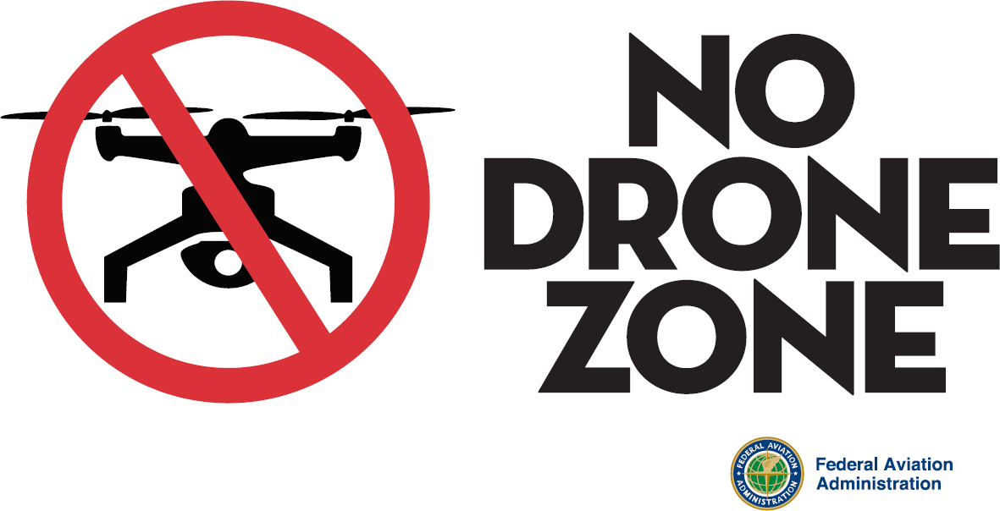

# Local UAS Regulations {#ch-local-UAS-regulations}

Any regulatory agency or private property owner can make rules and regulations within their jurisdiction (within reason).  The FAA's jurisdiction is the sky and aviation support (licensing, registration, infrastructure).  

However, there are other aspects of UAS activity that may be subject to local rules and regulations.  

State and local powers include

- Land Use
- Trespass
- Privacy
- Noise ordinances
- Wildlife conservation
- Insurance

It is allowed for a State, county or city to place restrictions on where and when drones may take off and land (land use jurisdiction), to define what constitutes invasion of privacy, or to require insurance to operate for or within a jurisdiction.  It is your responsibility to 

The UC Center of Excellence will help assist you in identifying applicable local regulations, however you are responsible for ensuring your regulatory compliance with all local regulations.

## Searching for Local UAS Regulations

There is no easy database for applicable UAS regulations - you will likely have to search multiple locations.  Most county and state owned land that is set aside for conservation often have established processes for research permits that are good starting points for UAS use.

Some good resources:

- State level regulations are typically associated with state managed lands, wildlife conservation, privacy and insurance.
- County and Municipal Codes often include regulations for city/county parks and open spaces, typically on land use, trespass and privacy.
- Directors or on-site managers are often good people to ask for permit processes and costs

## No Drone Zones

Please respect local ordinances, even if you do not agree with them.  Do not look for ways to circumvent or utilize a loophole if it is counter to the local communities desires.  If you are operating for research or education, you are acting as a representative of the University of California, and we strive to be good neighbors and collaborative with all communities.

```{r no-drone-zone, fig.cap='No Drone Zone Sign', out.width='80%', fig.asp=.75, fig.align='center', echo=FALSE}

```

If you feel strongly, engage the local community in outreach and discussion and work to change their views. But recognize that what you want may not ever be what they want, and you may not be able to change their minds.  If you are struggling to get access to your desired site, feel free to reach out to us and we'll see if we can find an alternative location.