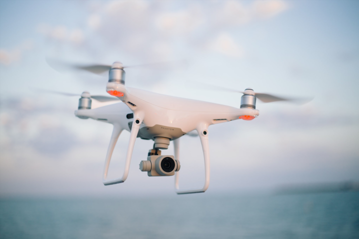
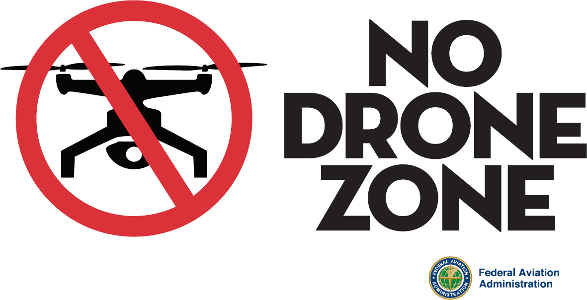
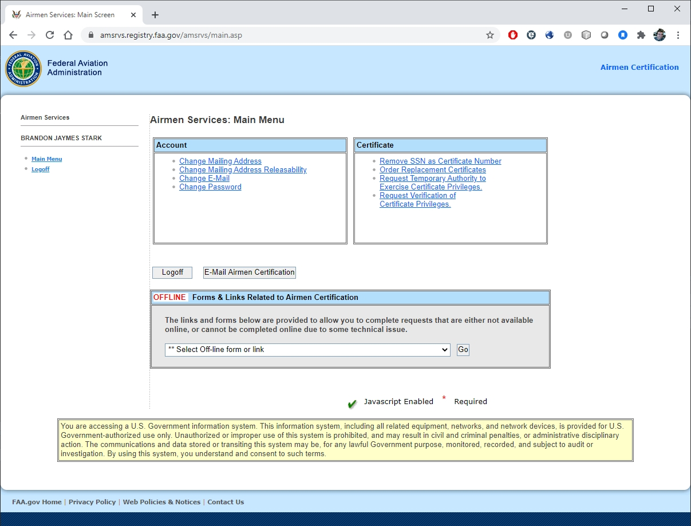

# Other Information

Do you have other questions?  That's ok - there's a lot of information and this guide only covers the big items.  Here are some other pieces of information that you might find useful. 

But don't forget, if you have a question that is not answered here, you can always reach out to us as UASsafety@ucmerced.edu or schedule an online appointment with our [Booking link](https://outlook.office365.com/owa/calendar/UCCenterofExcellenceonUASSafety@merced.onmicrosoft.com/bookings/)


```{r drone2, fig.cap='Flying drones is fun but can be complicated', out.width='75%', fig.asp=.75, fig.align='center', echo=FALSE}

```

## Common UAS Regulation Violations {#common-UAS-violations}

Unless given special permission by the FAA under Part 107 regulations, you are only allowed to operate 

 - Within Visual Line of Sight
 - Not Over People
 
Unfortunately, these are two of the most common UAS violations that we see, especially with videos on the internet.  Within the UC system, we are obligated to follow all applicable regulations. So even if you see someone else fly in violation of the laws, it's not ok for you to replicate it.
 
 
### Visual Line of Sight

Visual line of sight means that the pilot of the drone must be able to see the drone throughout the entire flight in order to

- know the drone's location
- determine the drone's attitude (orientation), altitude, and direction of flight
- observe the airspace for other air traffic or hazards
- determine that the drone does not endanger the life or property of another

The pilot must be **able** to do the above at all times, but doesn't have to be at all times - meaning he or she may glance at other objects, as long as the drone never leaves the pilot's ability to resume looking at the drone at any time.  

At any given time, at least the pilot or any visual observers must maintain visual line of sight - meaning while the pilot is looking away, there must be a visual observer to watch the drone during that time.

#### A Speck in the Sky is not Sufficient

At all times, your drone must be close enough that you can tell which direction the drone is facing, how high it is and whether there are any hazards.  If all you can see of your drone is a small dot, it means you've gone too far.  In practice, your visual distance may be significantly impaired by trees or buildings in the horizon that may make it difficult to see the drone.  

Common Drones and recommended max visual distance (on a clear day in a rural location)

- **DJI Mavic Series** 900 ft horizontal distance
- **DJI Phantom Series** 1200 ft horizontal distance
- **DJI Matrice 600 Pro** 3000 ft horizontal distance
- **Fixed-wing (10ft wingspan)** 5000 ft horizontal distance

#### You must be able to assess risk

If you can't see the sky around the drone or the ground below the drone as in Figure \@ref(fig:vlos), you're not within visual line of sight.  

```{r vlos, fig.cap='Visual Line of Sight', out.width='80%', fig.asp=.75, fig.align='center', echo=FALSE}
knitr::include_graphics('images/VLOS_G.png')
```

If this is a scenario that you're looking to do, you may be able to deploy a helper to assist to maintaining a clear flight operational area.  However, at no point is the drone allowed to be not viewable by the pilot.   

### Operations over Human Beings

Starting April 2021, drones may be issued a special Category certification that allows for operations over people.  Table \@ref(tab:OOPS) contains an overview of the requirements and restrictions for flight operations over people.

**Category 0, or Unlisted**

Drones that do not have the Category certification are prohibited from operations over people.  In addition to your drone not being allowed to be flown directly over people (107.39), they are prohibited from flying in a manner that poses a hazard to other people in the event of a loss of control of the drone for any reason (107.19(c)).  The combination of the two regulations form the majority of the restrictions around people. For drones without the correct Category Certification, you may only fly above people who are part of the immediate flight crew and whose tasks include ensuring flight safety.  It is not sufficient to provide spectators with personal protective equipment (PPE), or ask spectators to sign waivers.  

**Category 1**

Category 1 classification is for drones that weigh less than 0.55 lbs and have rotor protection, such as prop guards.  These are assumed to have minimal safety risk for operations over people and moving vehicles, and as such, they are allowed to operate in transit over people.  This means that the drone can pass over other people, but may not hover over them.  If the drone is equipped with Remote ID, then the drone may hover over people, or open air assemblies of people. Starting in September 2023, all drones that do not have Remote ID will be restricted to special zones known as FAA Recognized Identification Areas.

**Category 2**

Category 2 classification is for drones that have been granted a certificate that they will not cause a severe injury and include rotor protection, such as prop guards.  The FAA provides a list of all models of drones that are certified for Category 2 operations. Similarly to Category 1, these are assumed to have safety risk for operations over people and moving vehicles, and as such, they are allowed to operate in transit over people.  This means that the drone can pass over other people, but may not hover over them.  If the drone is equipped with Remote ID, then the drone may hover over people, or open air assemblies of people. Starting in September 2023, all drones that do not have Remote ID will be restricted to special zones known as FAA Recognized Identification Areas.

**Category 3**

Category 3 classification is for drones that have been granted a certificate that they will not cause a fatal injury and include rotor protection, such as prop guards.  The FAA provides a list of all models of drones that are certified for Category 2 operations. Category 3 is the highest level of allowable risk and are restricted to only in transit flights over people with or without Remote ID.  Flying over open air assemblies of people is prohibited unless the drone is equiped with Remote ID and the all persons the drone is flying over has consented.  

**Category 4**

Category 4 classification is a special authorization case for drones that have obtained a Part 21 Airworthiness Certification. The airworthiness certificate will specify the requirements and restrictions for operations over people.


Table: (\#tab:OOPS) Operations Over People

| Category     | Requirements     | With Remote ID   | Without Remote ID          |
|-------------:|:----------------:|:----------------:|:--------------------------:|
| **Cat 0**    |  None            | Not allowed      | Not allowed                |
| **Cat 1**    | Under 0.55 lbs <br> Prop Guards                                       | In transit flights over people <br> Flights over open air assemblies             | In transit flights over people <br> Only in FRIAs (2023)   |
| **Cat 2**    | FAA certification <br> Not cause a severe injury <br> Prop Guards     | In transit flights over people <br> Flights over open air assemblies             | In transit flights over people <br> Only in FRIAs (2023)   |
| **Cat 3**    | FAA certification <br> Not cause a fatal injury <br> Prop Guards      | In transit flights over people <br> Flights over consenting open air assemblies  | In transit flights over people <br> Only in FRIAs (2023)   |
| **Cat 4**    | FAA Airworthiness Certification                                       | In transit flights over people <br> Flights over open air assemblies             | In transit flights over people <br> Only in FRIAs (2023)   |


## Local UAS Regulations {#local-regulations}

Any regulatory agency or private property owner can make rules and regulations within their jurisdiction (within reason).  The FAA's jurisdiction is the sky and aviation support (licensing, registration, infrastructure).  

However, there are other aspects of UAS activity that may be subject to local rules and regulations.  

State and local powers include

- Land Use
- Trespass
- Privacy
- Noise ordinances
- Wildlife conservation
- Insurance

It is allowed for a State, county or city to place restrictions on where and when drones may take off and land (land use jurisdiction), to define what constitutes invasion of privacy, or to require insurance to operate for or within a jurisdiction.  It is your responsibility to 

The UC Center of Excellence will help assist you in identifying applicable local regulations, however you are responsible for ensuring your regulatory compliance with all local regulations.

### Searching for Local UAS Regulations

There is no easy database for applicable UAS regulations - you will likely have to search multiple locations.  Most county and state owned land that is set aside for conservation often have established processes for research permits that are good starting points for UAS use.

Some good resources:

- The [Drone Map of California](https://ucdrones.github.io/map/) lists all of the City and County drone regulations in California
- State level regulations are typically associated with state managed lands, wildlife conservation, privacy and insurance.
- County and Municipal Codes often include regulations for city/county parks and open spaces, typically on land use, trespass and privacy.
- Directors or on-site managers are often good people to ask for permit processes and costs


### No Drone Zones

Please respect local ordinances, even if you do not agree with them.  Do not look for ways to circumvent or utilize a loophole if it is counter to the local communities desires.  If you are operating for research or education, you are acting as a representative of the University of California, and we strive to be good neighbors and collaborative with all communities.

```{r no-drone-zone, fig.cap='No Drone Zone Sign', out.width='80%', fig.asp=.75, fig.align='center', echo=FALSE}

```

If you feel strongly, engage the local community in outreach and discussion and work to change their views. But recognize that what you want may not ever be what they want, and you may not be able to change their minds.  If you are struggling to get access to your desired site, feel free to reach out to us and we'll see if we can find an alternative location.

## Update or Replace a License {#replace-license}

Did you move or change names?  Remember that you must inform the FAA within 30 days.

The easiest way to update your information with the FAA is through the Airmen Services page: https://amsrvs.registry.faa.gov/amsrvs/default.asp (Figure \@ref(fig:airmen-services))

On this page, you can 

- Change your address
- Order a replacement certificate ($2)
- Change status of address releasability (by default, all addresses on pilot licenses, including drone licenses are public)
- Remove SSN as certificate number (for those with older manned aviation licenses)
- Request verification of certificate privileges

```{r airmen-services, fig.cap='FAA Airmen Services Web Page', echo=FALSE, out.width='70%', fig.asp=.75, fig.align='center'}

```

You do not need to order a new Remote Pilot Certificate when you update your address, but ordering a replacement certificate is the only way that you'll get a new copy of your certificate with your new address.  

