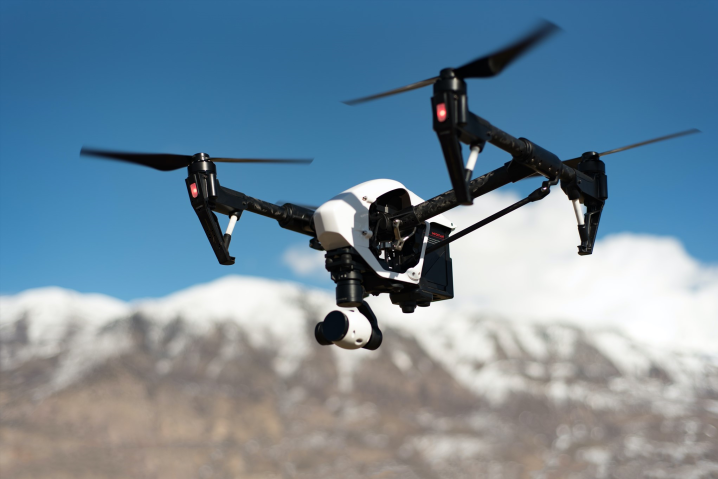

# Drones and Privacy {#ch-privacy}

The capture and use of photographs and videos from a drone raises new concerns on the rights, privacies, and permissions that involve both the operators of a drone and individuals that are uninvolved in the operation. 

The University of California recognizes the important value of privacy and strives to achieve an appropriate balance ensuring an appropriate level of privacy, nurturing an environment of openness, honoring its obligation as a public institution to remain transparent while safe guarding information about individuals.

```{r drone1, fig.cap='Flying Cameras', out.width='75%', fig.asp=.75, fig.align='center', echo=FALSE}

```

## Best Practices

- **Do not** use a drone to monitor or record activities where there is a reasonable expectation of privacy.
- **Do not** use a drone for unapproved recordings of any campus events or performances, or for any unlawful purposes.
- **Do not** use a drone to harass people or intentionally disrupt events.
- **Do not** fly a drone over private property without prior approval.
- **Do not** use a drone for the specific purpose of persistent and continuous collection of identifiable data about individuals without the consent of the data subjects.
- **Do not** retain identifiable data longer than reasonably necessary to fulfill a purpose.
- **Do not** knowingly publicly disclose data collected with a drone without undertaking a reasonable effort to obfuscate or de-identify identifiable data unless the data subjects provide specific consent to the disclosure.


- **Do** make a reasonable effort to remain conspicuous and visible during flight operations.
- **Do** make a reasonable effort to provide prior notice to individuals of the general timeframe and area that they may anticipate a drone intentionally collecting data.
- **Do** establish and make available a Privacy Statement for drone data if the drone may intentionally or unintentionally collected identifiable data. The policy should be appropriate to the size and complexity of the data collected.
- **Do** be considerate of other people's concerns over privacy, security and safety.
- **Do** contact the Office of Research Compliance and Integrity if identifiable data is to be used for human-subject research.
- **Do** take steps to ensure the security of any identifiable data.

## Privacy Statement

An effective privacy statement is concise and easy to understand.  Consult with your campus Privacy Officer or Institutional Review Board for additional help or guidance in developing an effective privacy policy.

### Topics for a Privacy Statement

- The purposes for which the drone will collect identifiable data
- The kinds of identifiable data the drone will collect
- Information regarding any data retention and de-identification practices
- Examples of the types of any entities with who identifiable data will be shared
- Information on how to submit privacy and security complaints or concerns
- Information describing practices in responding to law enforcement requests

NOAA has an excellent example of a detailed drone privacy statement: [Link, pdf](#https://www.cio.noaa.gov/itmanagement/pdfs/Signed_UAS_PrivacyPolicy.pdf)

### Do I need to write a Privacy Statement

While most flight operations are on UC property and within dedicated research locations, such as field stations and reserves, a significant number of projects are on public land, near non-participants or in collaboration with private collaborators.  As such, there may be unintentional impacts to the privacy and well-being of others.  When in doubt, always consider putting together at least a minimal document.
