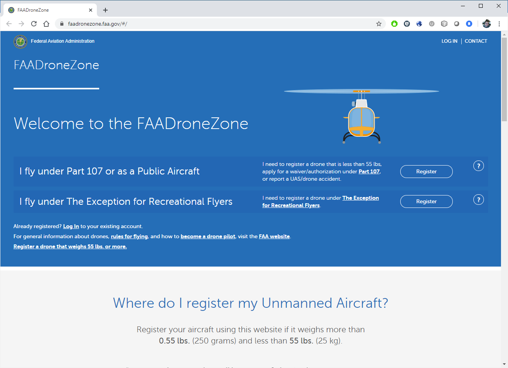
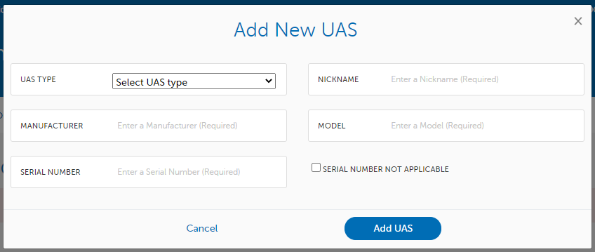
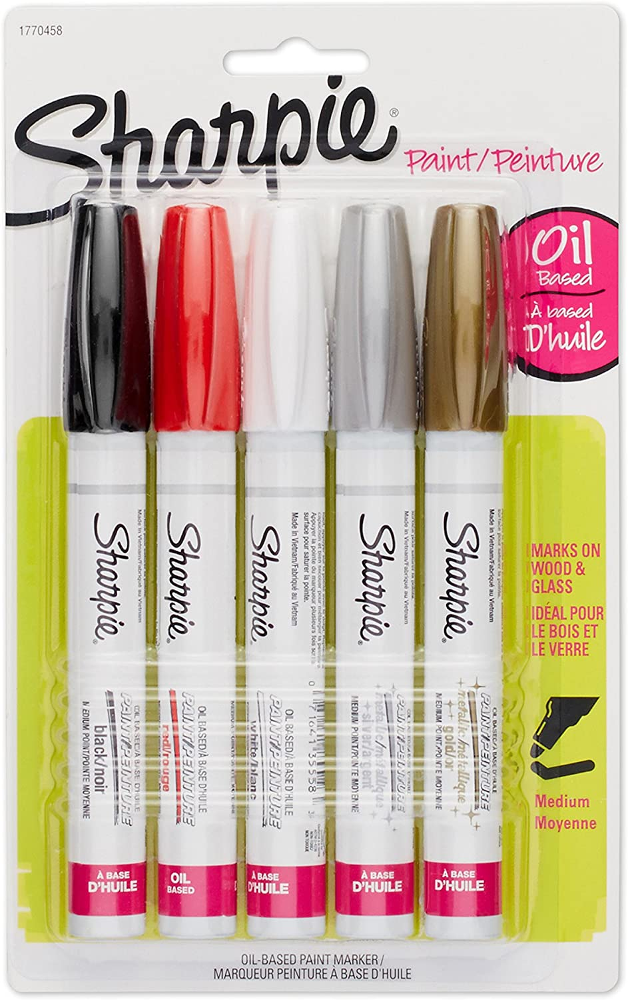

# Register your Drone {#ch-register}

> This page is for the registration of your drone with the Federal Aviation Administration.  For information on how to register your drone with the UC system, see Chapter \@ref(ch-add-drone).

All drones that weigh more than 0.55 lbs (250 grams) must be registered with the Federal Aviation Administration (FAA) to it's legal owner.

Any drone purchased through the University of California for university business, including teaching and research, is owned by the Regents of the University of California.  

You can register the drone through the FAA Drone Zone (https://faadronezone.faa.gov).  Registration costs only $5 per aircraft and only takes a couple of minutes.


## Create an account at DroneZone

Head to the FAA DroneZone (https://faadronezone.faa.gov) and select "I fly under Part 107 or as a Public Aircraft" \@ref(fig:reg-page)

```{r reg-page, fig.cap='FAA DroneZone', out.width='80%', fig.asp=.75, fig.align='center', echo=FALSE}

```

> Unfortunately, the FAA's drone registration website does not allow you to register drones for multiple groups or organizations.  If you're registering a drone on behalf of the University of California, you should use your UC email address as your account log in, and use a personal email address account for any personally-owned drones.

When you enter your Part 107 Account information, enter **Regents of the University of California** as your Part 107 Account Name to correctly register the drone to the UC system.


## Drone Registration

Once you have an account, on the dashboard will be an option to 'Manage sUAS Inventory.'  On that page, you'll be able to 'Add UAS' (in the upper right corner). This will bring up a dialog box (Figure \@ref(fig:add-UAS)) for you to enter your information.  Enter all the relevant information.

```{r add-UAS, fig.cap='Add new UAS Dialog Box', out.width='80%', fig.asp=.75, fig.align='center', echo=FALSE}

```

Once completed, 'Your Shopping Cart' will now show this drone's information and a new buttom for 'Checkout' will appear.  Click the button and the system will guide you through paying for the registration fee.

## Registration Certificate

Upon completion of paying for registration, the DroneZone will send you two emails, one with a receipt of payment and the other is a pdf copy of your UAS registration certificate (Figure \@ref(fig:reg-cert)).  Keep a copy of this registration certificate available at all times while you operate.  This can be done by either printing it out and placing it with your drone, or keeping a digital copy on your phone.

```{r reg-cert, fig.cap='Example UAS Registration Certificate', out.width='50%', fig.asp=.75, fig.align='center', echo=FALSE}
knitr::include_graphics('images/reg_cert.png')
```


## Marking the Drone

Your drone's registration number is the 10 digit alphanumeric code that starts with **FA**.  You must mark this on your drone on an external location, where it can be plainly visible.

We recommend either using a permanent oil-based fine tip paint marker (Figure \@ref(fig:markers)) or creating a label that can be strongly affixed to the drone.  We've found that regular sharpies or markers are rubbed off too easily to be effective.  

```{r markers, fig.cap='Oil-Based Paint Markers', out.width='50%', fig.asp=.75, fig.align='center', echo=FALSE}

```

If you'll be working with a fleet of aircraft, it may also be useful to mark the 'nickname' of the drone as well.


