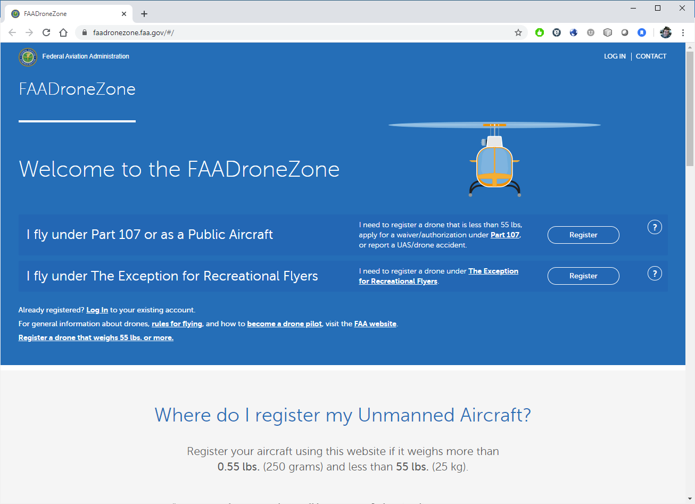
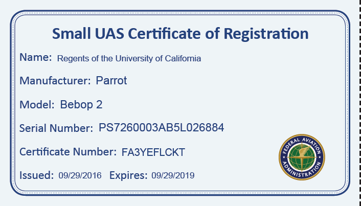

# Drone Rules and Regulations {#regulations}

Welcome to the world of Drones!  We're always happy to see new drone pilots and new drone projects.  But first, we have to introduce you to the ever-changing drone regulations.  

:::: {.notebox data-latex=""}
Don't forget that following the **DRONE** regulations are only one part of the UC Drone Policy.  Local rules, environmental regulations, export control, and even insurance requirements may require additional steps or have additional restrictions.  Helping you navigate through all of this is part of the UC Drone Flight Request process.
::::

<br>

**The Main 7 Rules**

1. Don't do anything unsafe
2. All drones must be registered
3. All pilots must have either a Drone License or a TRUST certificate
4. No flying farther than you can see
5. No flying over people
6. No flying above 400 ft
7. Stay away from other aircraft

There's a lot of details behind the above rules, including several exceptions.  So let's dive into them in more detail.


## Basic Drone Rules

In this page, we'll introduce some of the basic drone rules.  Basically, the rules for operating a drone can be boiled down to **"Do not do anything unsafe"** - but sometimes they have to be spelled out.
 
### Drone Operating Rules

- No flying farther than you can clearly see the drone
    - You must be able to see the drone at all times

```{r VLOS, fig.cap='Visual Line of Sight', out.width='70%', fig.asp=.75, fig.align='center', echo=FALSE}
knitr::include_graphics('images/VLOS_simple.jpg')
```    

- No flying above non-participants or moving cars
- No flying higher than 400 ft above the ground
- No reckless or careless flying that endangers the life or property of another
- No flying when the horizon visibility drops below 3 miles
    - This includes smog, fog, or haze
- No flying within 2000 ft laterally or 500 ft vertically of any cloud
    - Including fog and low cloud layers on overcast days
    
```{r cloud-distance, fig.cap='Minimum Distances from Clouds, Fog or Haze', out.width='70%', fig.asp=.75, fig.align='center', echo=FALSE}
knitr::include_graphics('images/cloud_distance.jpg')
```

- No flying faster than 100 mph
- No flying at night
- No operating a drone from a moving vehicle

### Airspace Rules

- The drone must always get out of the way and always stay well-clear of all manned aviation traffic, including airplanes, helicopters, gliders, paragliders, hot air balloons and parachutes.
    - Even if "you were there first"
- Permission is required to fly in any controlled airspace (Class B, C, D, and surface Class E)
    - Controlled airspace is typically found within 5 miles of most airports for commercial travel and large general aviation airports (non-commercial travel) - See Figure \@ref(fig:SUAS-airspace-regs)
    
```{r SUAS-airspace-regs, fig.cap='Small UAS Airspace Rules', out.width='90%', fig.asp=.75, fig.align='center', echo=FALSE}
knitr::include_graphics('images/SUAS_airspace_map.jpg')
```

- No interfering with aviation traffic patterns at any airport, heliport, or seaplane base
    - Traffic patterns include more than just the immediate take off and landing - it also includes the downwind and base legs (See Figure \@ref(fig:traffic-patterns))


```{r traffic-patterns, fig.cap='Typical Airport Traffic Patterns (FAA Aeronautical Information Manual)', out.width='60%', fig.asp=.75, fig.align='center', echo=FALSE}

```

### Operator Rules

- There must always be a Remote Pilot in Command (RPIC)
    - The RPIC is the one in charge of the flight operations and is ultimately responsible for all safety and operations
    - The RPIC doesn't always have to be the one manipulating the flight controls of the drone - it could be the RPIC is letting a student learn to fly under his/her direct supervision.
    - The RPIC may only operate (supervise) one drone at a time
- The RPIC must have an FAA Drone License (or be exempt*)
    - More Info Here: [FAA Drone License](#ch-license)
- The RPIC must be at least 16 years of age, and must be able to speak, write and understand English.
    - No restriction on nationality but a license does require Federal documentation such as a Passport.
- No one may operate a drone or act as any direct participant in the operation of a drone if he or she knows, or has reason to know, that he or she has a physical or mental condition that would interfere with the safe operation of the drone.
- No one may operate a drone or act as any direct participant in the operation of a drone under the influence of alcohol or any drug that may inhibit decision making

```{r drugs, fig.cap='No drugs, alcohol or altered mind-states allowed during flight operations', out.width='70%', fig.asp=.75, fig.align='center', echo=FALSE}
knitr::include_graphics('images/no_drugs.jpg')
```

### Drone Rules

- All drones that weigh more than 0.55 lbs (250 grams) must be registered with the FAA 
    - Only use the FAA DroneZone website for registration (More Info here: [Register your Drone](#ch-registration))

```{r reg-page2, fig.cap='FAA DroneZone', out.width='80%', fig.asp=.75, fig.align='center', echo=FALSE}

```    

- Drones must weigh less than 55 lbs
    - Drones that weigh more than 55 lbs require rare special FAA authorization
- Drones may not drop or release hazardous material
    - Drones that drop biological or chemical agents for Agriculture require additional Federal and State authorizations
    - While not illegal, please do not drop glitter or confetti from a drone
- Any payload that is attached to the drone must be securely attached and may not adversely affect the controllability of the drone
- Weapons are not allowed to be attached or used on drones
- Tethered drones are not exempt from drone regulations


:::: {.notebox data-latex=""}
The topic of drone regulations can be very nuanced and complex.  We've shortened it to the basics in this section, but there may be scenarios or situations that may be exempt or have additional restrictions.  Always feel free to reach out to us at UASsafety@ucmerced.edu for a one-on-one consultation.
::::


## Drone Registration {#registration}

:::: {.notebox data-latex=""}
This page is for the registration of your drone with the Federal Aviation Administration.  For information on how to register your drone with the UC system, see Chapter \@ref(UCDrones-drone).
::::

### Drone Registration Requirements

All drones that weigh more than 0.55 lbs (250 grams) must be registered with the Federal Aviation Administration (FAA) to it's legal owner. 

Any drone purchased through the University of California for university business, including teaching and research, is owned by the **Regents of the University of California**.  


### How to Register

You can register the drone through the FAA Drone Zone (https://faadronezone.faa.gov).  Registration costs only $5 per aircraft and only takes a couple of minutes.


### Create an account at DroneZone

Head to the FAA DroneZone (https://faadronezone.faa.gov) and select "I fly under Part 107 or as a Public Aircraft" \@ref(fig:reg-page)

```{r reg-page, fig.cap='FAA DroneZone', out.width='80%', fig.asp=.75, fig.align='center', echo=FALSE}

```

**Important Note** Unfortunately, the FAA's drone registration website does not allow you to register drones for multiple groups or organizations.  If you're registering a drone on behalf of the University of California, you should use your UC email address as your account log in, and use a personal email address account for any personally-owned drones.

When you enter your Part 107 Account information, enter **Regents of the University of California** as your Part 107 Account Name to correctly register the drone to the UC system.

:::: {.notebox data-latex=""}
If you already have an account, go into your profile settings, and you can modify the **Part 107 Account Name** on the popup.
::::

### Drone Registration

Once you have an account, on the dashboard will be an option to 'Manage sUAS Inventory.'  On that page, you'll be able to 'Add UAS' (in the upper right corner). This will bring up a dialog box (Figure \@ref(fig:add-UAS)) for you to enter your information.  Enter all the relevant information.

```{r add-UAS, fig.cap='Add new UAS Dialog Box', out.width='80%', fig.asp=.75, fig.align='center', echo=FALSE}
knitr::include_graphics('images/Add_new_UAS.png')
```

Once completed, 'Your Shopping Cart' will now show this drone's information and a new buttom for 'Checkout' will appear.  Click the button and the system will guide you through paying for the registration fee.

### Registration Certificate

Upon completion of paying for registration, the DroneZone will send you two emails, one with a receipt of payment and the other is a pdf copy of your UAS registration certificate (Figure \@ref(fig:reg-cert)).  Keep a copy of this registration certificate available at all times while you operate.  This can be done by either printing it out and placing it with your drone, or keeping a digital copy on your phone.

```{r reg-cert, fig.cap='Example UAS Registration Certificate', out.width='50%', fig.asp=.75, fig.align='center', echo=FALSE}

```


### Marking the Drone

Your drone's registration number is the 10 digit alphanumeric code that starts with **FA**.  You must mark this on your drone on an external location, where it can be plainly visible.

We recommend either using a permanent oil-based fine tip paint marker (Figure \@ref(fig:markers)) or creating a label that can be strongly affixed to the drone.  We've found that regular sharpies or markers are rubbed off too easily to be effective.  

```{r markers, fig.cap='Oil-Based Paint Markers', out.width='50%', fig.asp=.75, fig.align='center', echo=FALSE}
knitr::include_graphics('images/oil-based-markers.jpg')
```

If you'll be working with a fleet of aircraft, it may also be useful to mark the 'nickname' of the drone as well.


## Operations over People

There is a common misconception is related to flight operations over people that must be addressed. Far too many people are passing along incorrect information.


:::: {.notebox data-latex=""}
The FAA prohibits flight operations over people - single persons, moving vehicles and open-air assemblies of people - except in very specific circumstances. 
::::


### Operations Over People
FAA regulation 14 CFR 107.39 prohibits operations over people with three (3) exceptions:

1. The pilot
2. Persons in a covered structure or stationary vehicle
3. In accordance to Subpart D (introduced April 2021)


Additionally, FAA regulation 14 CFR 107.19(c) requires the pilot to ensure the drone poses no undue hazard to other people or property in the event of a loss of control. No exceptions.

### Subpart D

Introduced in April 2021, 14 CFR 107 Subpart D provides a pathway for flight operations over people. A summary of those rules is described here: https://www.faa.gov/uas/commercial_operators/operations_over_people

Subpart D introduces four (4) categories of drones that are allowed to operate over people.

1. Category 1 - Drones under 250 grams with propeller guards
2. Category 2 - Drones certified by the FAA to not cause injury to a human being that is equivalent to or greater than the severity of injury caused by a transfer of 11 foot-pounds of kinetic energy upon impact from a rigit object.
3. Category 3 - Drones certified by the FAA to not cause injury to a human being that is equivalent to or greater than the severity of injury caused by a transfer of 25 foot-pounds of kinetic energy upon impact from a rigit object.
4. Category 4 - Drones certified by the FAA under a Special Airworthiness Certificate

**Any Drone That Does Not Qualify Under One of These Four Categories Is Not Eligible For Any Operations Over People**

The full list of FAA-certified drones can be found here: https://uasdoc.faa.gov/listDocs, filter by OOP - The sole entry is the AgEagle eBee X.

### Open-Air Assembly vs 'Brief, One-Time Transiting

The note regarding the difference between ‘sustained flight over an open-air assembly’ vs. ‘a brief, one-time transiting’ is in regards to compliance with Remote Identification regulations. Remote ID compliance is required for sustained flight over an open-air assembly, otherwise without Remote ID, operations over people are restricted to only ‘brief, one-time transiting’ over persons.


