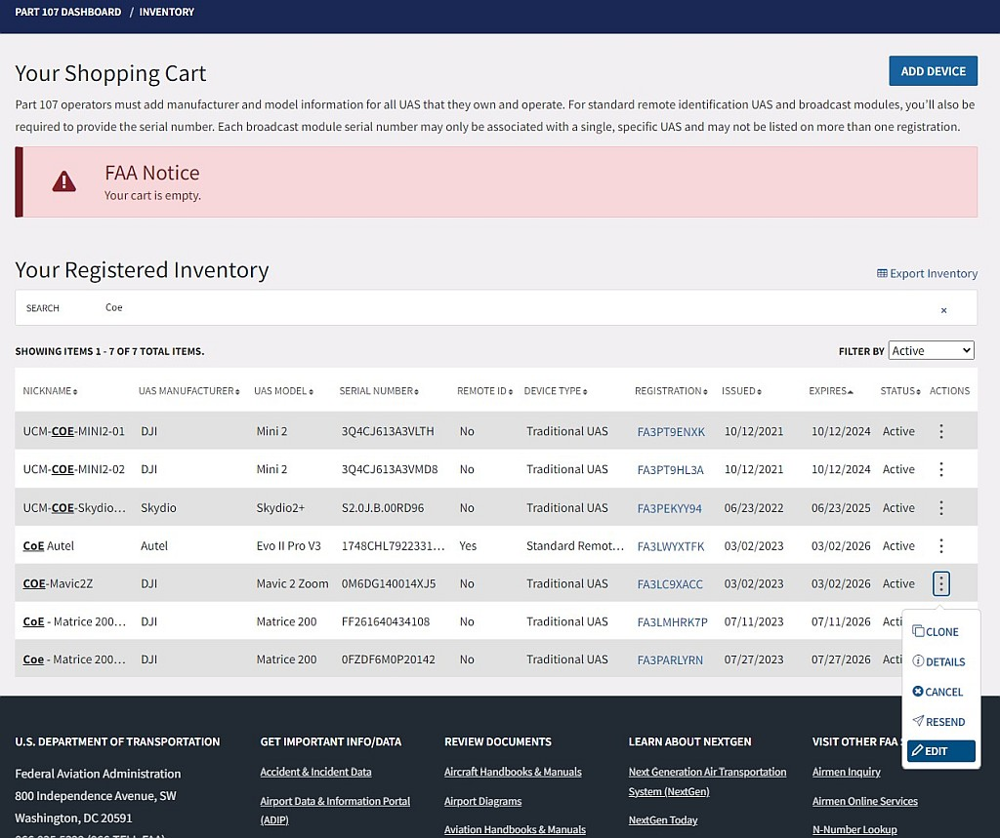
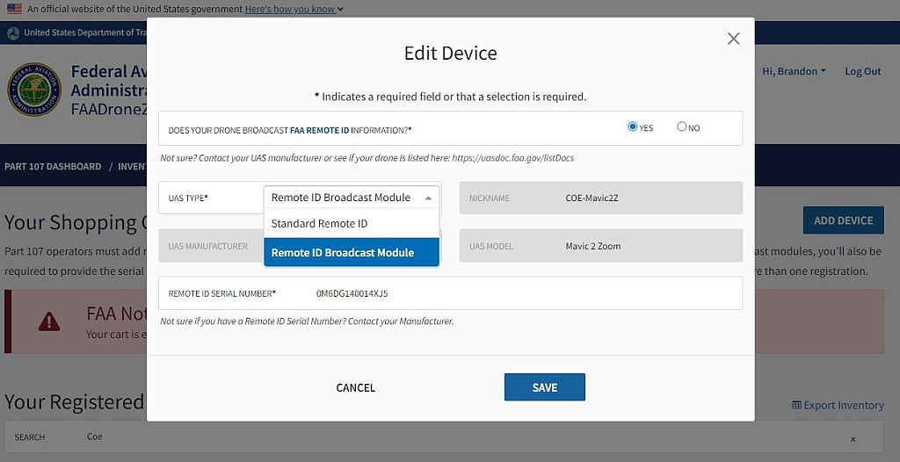

# Remote Identification

## What is Remote Identification?

### Types of Remote Identification

## Getting Remote ID

text

### Standard Remote ID

text

### Broadcast Remote ID

text

### Updating your Registration

To complete the transition to Remote ID, all drone registrations must be updated on the FAA Drone Zone. Updating your UAS Registration is free and can be done at any time.

1. Log into FAA Drone Zone
2. From your dashboard, enter your drone inventory.  
3. Find the drone registration you want to update, and click the three vertical dots to open the menu. 
    - Select 'Edit' from the dropdown menu.
4. In the new window, when it asks 'Does your drone broadcast FAA Remote ID information?' select 'YES.'

```{r ridedit, fig.cap='Edit your UAS Registration', out.width='75%', fig.asp=.75, fig.align='center', echo=FALSE}

```

5. Update your UAS TYPE - the options will change when you select 'YES'
    - Select either 'Standard Remote ID' or 'Remote ID Broadcast Module'
6. Enter in the Remote ID Serial Number
    - If your drone has Remote ID built-in (ie, Standard Remote ID), use your drone's serial number.
    - If you are adding a Remote ID Broadcast Module, use the Remote ID Broadcast Module's serial number.

```{r rideupd, fig.cap='Update your Serial Number', out.width='75%', fig.asp=.75, fig.align='center', echo=FALSE}

```

## Reading Remote Identification

Remote ID messages are relayed in two mechanisms with two versions: 

- Bluetooth 4 Legacy Advertising
- Bluetooth 5 Long Range Advertising
- WiFi Neighbor Awareness Network (NAN)
- WiFi Beacon

### Mobile Devices

- Android devices can receive RID messages over Bluetooth and Wi-Fi
- iOS devices can only receive RID messages over Bluetooth


By default, Android versions 8.0 and above prohibit frequent scans of Wi-Fi networks. To enable high-frequency scans necessary for Remote ID, you must disable Wi-Fi scan throttling.

1. **Turn On Developer Mode** 

    - Go to "Settings"
    - Tap "About Device" or "About Phone"
    - Tap "Software Information"
    - Tap "Build number" seven (7) times.
    - Enter your pattern, PIN or password to enable the Developer options menu
    - "Developer Options" menu will now appear in your Settings Menu
    
2. **Enter Developer Options**
3. **Scroll Down to the Network category**
4. **Turn Off Wi-Fi scan throttling**


### Drone Broadcasting

The following table depicts the mechanism that each drone uses for Remote ID.  

```{r, echo=FALSE}
dji<-list("-","X")
aut<-list("X","-")
sky<-list("-","-")
bdb<-list("X","X")
dtb<-list("X","X")


POC = data.frame(rbind(dji,aut,sky,bdb,dtb))
colnames(POC) <- c("Bluetooth","Wi-Fi")
rownames(POC) <- c("DJI Series","Autel Series","Skydio","BlueMark db120","Dronetag Beacon")
knitr::kable((as.matrix(POC[,])), "pandoc",row.names = NA, longtable = TRUE, booktabs = TRUE)
```

DJI drones can only be detected by Android devices. Skydio's Remote ID does not appear to be functional.

## Frequently Asked Questions

1. Can I move my Broadcast