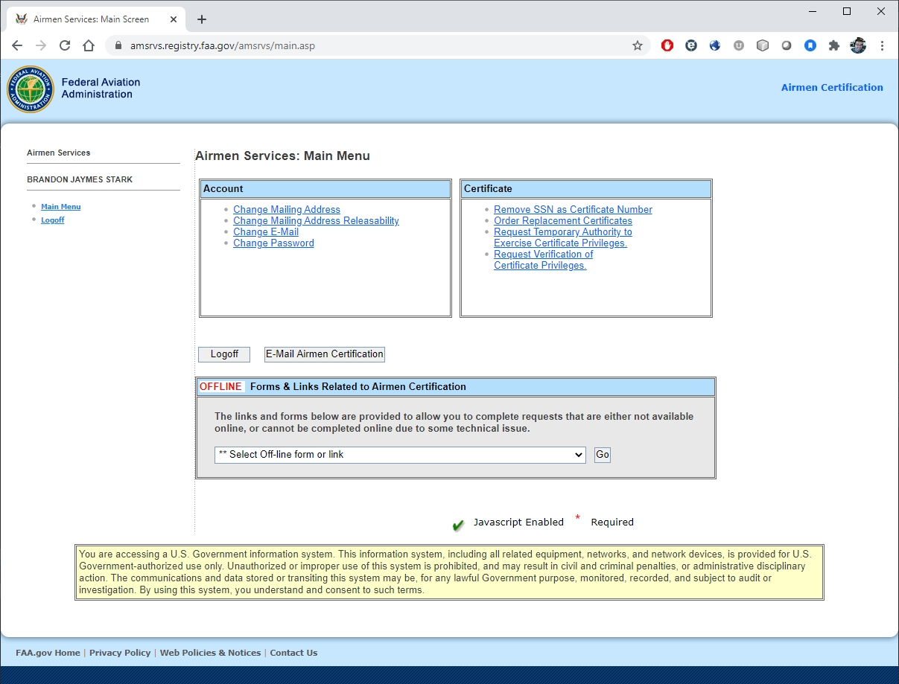

# Update or Replace a License {#ch-replace-license}

Did you move or change names?  Remember that you must inform the FAA within 30 days.

The easiest way to update your information with the FAA is through the Airmen Services page: https://amsrvs.registry.faa.gov/amsrvs/default.asp (Figure \@ref(fig:airmen-services))

On this page, you can 

- Change your address
- Order a replacement certificate ($2)
- Change status of address releasability (by default, all addresses on pilot licenses, including drone licenses are public)
- Remove SSN as certificate number (for those with older manned aviation licenses)
- Request verification of certificate privileges

```{r airmen-services, fig.cap='FAA Airmen Services Web Page', echo=FALSE, out.width='70%', fig.asp=.75, fig.align='center'}

```

You do not need to order a new Remote Pilot Certificate when you update your address, but ordering a replacement certificate is the only way that you'll get a new copy of your certificate with your new address.  