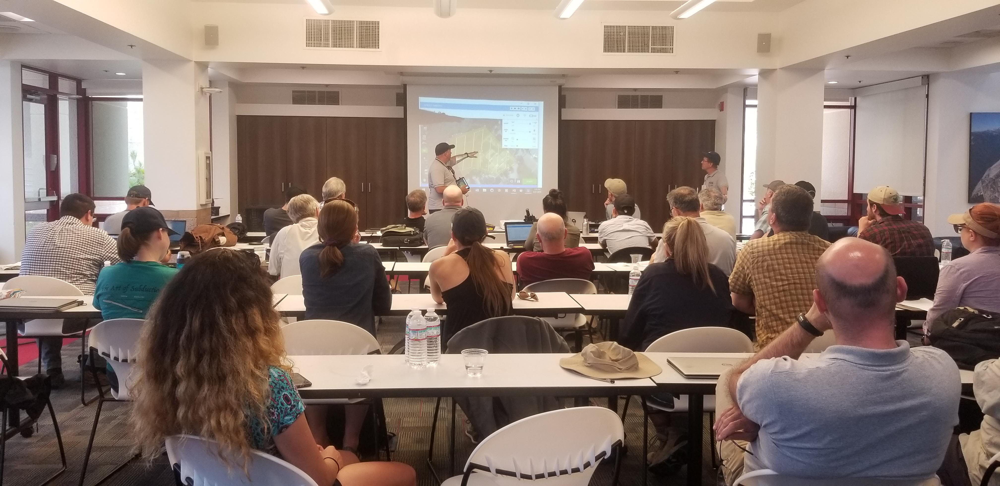
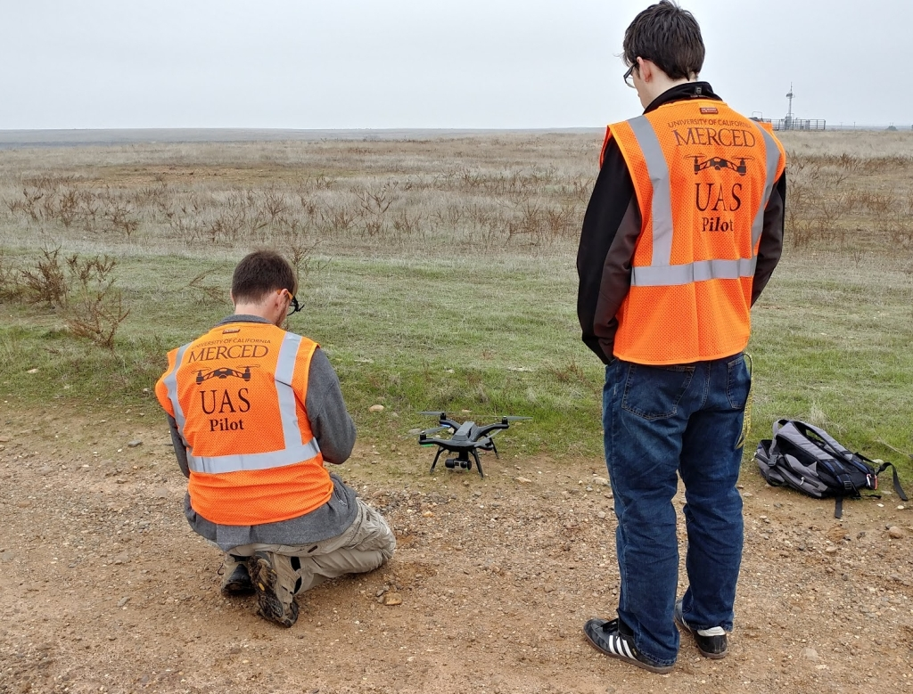
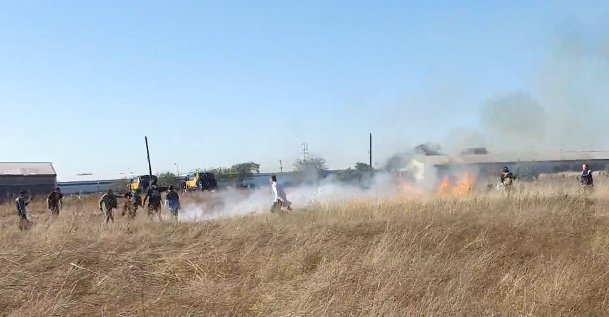
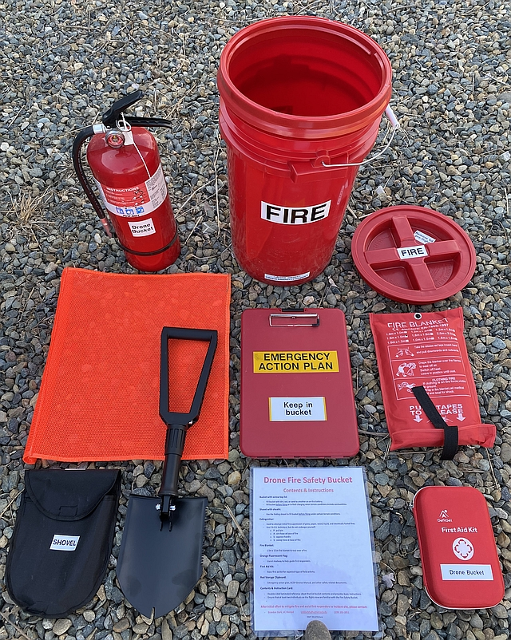

# Drone Safety {#safety}

Drone flight safety beings with planning - lots of things can go wrong, but if you're prepared, you can mitigate issues.

In this chapter, we'll go over a variety of safety tips, including some standard guidance, mission planning guidance and fire safety.

```{r training, fig.cap='DroneCamp Training Workshop', out.width='75%', fig.asp=.75, fig.align='center', echo=FALSE}

```

## Drone Safety Standards

There's a lot of items to consider when it comes to drone safety. Here, we'll just give a couple of standard guidance:

### Standard Guidance

- Establish a **buffer** or **safe-zone** between the Unmanned Aircraft and any non-participating persons or sensitive locations. A good rule-of-thumb is to maintain a buffer or safe-zone of one-fourth (0.25) of the flight altitude**.
- **Visual Observers** and supporting ground crew should be utilized when available. Supporting ground crew should assist in ensuring safety to all non-participating persons.
- All members of the flight crew should **be conspicuous** and wear **professional, identifying apparel** such as university-branded hats, shirts or lanyards with IDs.
- **High visibility reflective vests** must be worn when operating **near roads** or **in parking lots**.  
- When operating in fenced areas, **stay within the fenced areas** unless there is sufficient visibility on the other side to ensure safety to non-participants.
- Never fly in areas where **drone activity is prohibited or restricted**.
- **Always be a good neighbor** and ensure that your drone activity is not disruptive to other authorized activities.
- Pay attention to **sloping terrain and trees**. It is too easy to misjudge and autonomously fly into a tree.

```{r hivis, fig.cap='UAS operators with high visiblity vests, UC Merced', out.width='75%', fig.asp=.75, fig.align='center', echo=FALSE}

```

### Operating on Campus or other busy locations

- Utilize the **UC UAS Mission Planning Template** ([link](http://ucdrones.github.io/library/mission_planning_template.docx)) to systematically develop your flight plan
- **Pre-plan each flight** in detail when operating in **uncontrolled locations** in proximity to non-participating person. Use this planning to look for potential safety issues and identify mitigating actions. 
- **High visibility vests are recommended** when near nonparticipants or in public areas.
- Don't rely on passive crowd control measures such as **Orange cones**. Supplement any portable pedestrian control equipment (cones, caution tape, signs) with ground personnel. If spectators are expected, a supporting ground crew member should be tasked with **preventing spectators from distracting the RPIC** with questions or comments.
- When operating near roads, a supporting ground crew member should be tasked with being located near the road to monitor traffic, and if necessary, retrieve a fallen Unmanned Aircraft before it becomes a road hazard.
- **Flying above buildings and structures may minimize risk** to pedestrians, but contact the facility manager to properly evaluate the potential risks. Some **campus buildings are outfitted with research or communication equipment** on rooftops.


## Planning a Mission {#mission}

Plan your flight mission with safety in mind from the get go.  Use the Site Analysis process to figure out exactly how to accomplish your mission and determine any other supplies or support you might need.


### Site Analysis Process
One of the best things you can do when you start planning your mission is to conduct a thorough site analysis process.  Do a methodical review of where you want to fly, taking into consideration what you want out of the flight and any hazards that exist.  

Following your methodical review, you can start planning your flight paths, assess visibility, decided where to put VOs or other helpers, and have ample details for any emergency action plans.

### Site Analysis Steps
- Print out a satellite image of the site
- Evaluate Data Requirements
    - Identify the region(s) of interest
    - Identify the best visual angles
        - Consider the time of day, shadows and reflective surfaces
    - Estimate the best flight region and flight paths
- Identify any constraints
    - Mark any airspace issues
        - Airspace Class
        - Airports, Heliports
        - Flight Patterns
    - Mark any vertical structures
        - Changes in elevation
        - Buildings
        - Towers, powerlines
        - Trees
        - Other vertical obstructions
    - Mark any ground obstructions
        - Smaller structures
        - Gates, Fences
        - Hedges, Shrubs
        - Other obstructions that may impede access
    - Identify any other safety or regulatory issue
        - Fire risks
        - Wildlife impacts
        - Physical access to site
    - Identify potential site access points by non-participants
        - Pedestrian walkways
        - Bike paths
        - Building doors/access points
- Refine flight plan with constraints
    - Select a launch/recovery site that can be reasonably secured
    - Assess whether any vertical structure may impede visual line of sight
    - Assess whether any ground obstruction may limit any emergency recovery operations
    - Consider multiple flights per Mission to achieve mission goals
- Plan flight crew locations
    - Pilot and VO at Launch/Recovery point
        - Consider if Pilot/VO may require relocation during flight operation 
    - Remote VOs and other ground crew support
        - May be tasked to redirect non-participant traffic away from flight zone
- Iterate as necessary to meet Mission Objectives

### Site Analysis Guide

`r if (knitr::is_latex_output())'
Please visit the webpage for a walkthrough of the Site Analysis Process
'`

```{r, include=knitr::is_html_output(excludes=c("epub")), echo=FALSE, out.width='100%'}
knitr::include_url("support/SiteAnalysis/story.html", height="720px")
```

### Resources

Make regular use of planning tools and resources here: [UC Drones Resources](https://ucdrones.github.io/ch-resources.html).  Don't be afraid to edit/update/modify them as you see fit.  All of these should be considered living documents, tailored to enable you to make safety decisions with as much information as possible.


## Fire Safety {#fire-safety}

While UAS accidents and incidents involving fire are rare, they are a valid and significant concern.  With the majority of UC UAS usage on field sites and other rural locations, the potential for the accidental sparking of fire is a concern.  A fire sparked by a UAS can spread quickly (Figure \@ref(fig:fire-start)) and with California's dry environment, can cause significant damage (Figure \@ref(fig:fire-damage)).

Everyone who flies a drone within the UC should take the [Drone Fire Safety Training Course](https://ucdrones.github.io/library/trainings/FireSafety/index.html)

```{r fire-start, fig.cap='Beginning of a fire from UAS accident at Richmond Field Station, UC Berkeley', out.width='75%', fig.asp=.75, fig.align='center', echo=FALSE}

```

```{r fire-damage, fig.cap='Post fire damage from UAS accident at Richmond Field Station, UC Berkeley', out.width='75%', fig.asp=.75, fig.align='center', echo=FALSE}
knitr::include_graphics('images/fire_damage.jpg')
```

### LiPo Battery Guidance

The most common cause of drone related fire is from misuse of LiPo batteries.  Special care should be taken when charging, discharging or storing LiPo batteries.  If the internal polymer cell of a LiPo battery is exposed to air, a violent chemical reaction starts that could explode, but more commonly releases significant amounts of smoke and heat that can ignite other fire fuel sources.  A LiPo battery fire is typically caused by a physical puncture to the battery or from misuse, such as overcharging or electrical shorts. 

**Recommended Best Practices**

- Always thoroughly inspect a battery before charging and use.  
    - Look for swelling, puffy cells, cracks in plastic, and charred debris along the contacts.
- Never use a battery that is not in good health. 
    - Consider batteries to be replaceable and consumable, rather than a permanent component of the UAS.
- Never store batteries in a hot car.
- Don't charge your batteries unless you're going to fly within the next day.
- After immediate use, place battery out of the sun but do not place within a closed container.  

    - Ensure there is sufficient airflow to allow the battery to cool.
    
- When done flying for the day, always charge your batteries at least back up to storage level.
- Do not charge an intelligent flight battery immediately after flight as the temperature may be too high. Wait until it cools down to room temperature before charging again.
- Store the battery in a dry and cool place, keep out of direct sunlight and away from any liquids
- Do not store or transport a battery with eyeglasses, watches, metal necklaces or other metal components that may short the battery
- When in transport, store the batteries in a safe container that will protect it from damage, squeezing, puncturing or falling. 

### Planning for Fire Mitigation

In addition to LiPo battery care, special effort must be taken to consider the fire risks in drone activity.  Consult the appropriate department (Fire, Field Safety, EH&S) if there are concerns over fire risk.  Minimize the potential for fire by monitoring where the drone will be flying and ensure that if a fire was to occur, the RPIC and any other persons, such as Visual Observers, are prepared to respond appropriately.  


**Guidance for fire safety**

- Everyone should take the [drone fire safety training course](https://ucdrones.github.io/library/trainings/FireSafety/index.html)
- Avoid flying on high fire risk days, including [Red Flag Warning](https://www.fire.ca.gov/programs/communications/red-flag-warnings-fire-weather-watches/) alerts issued by CAL FIRE.
- Never fly alone in areas of moderate to high fire risk
- Always bring a fire extinguisher and a shovel/bucket of sand to field sites.
- During flight operations:

    - Ensure that a crew member has easy access to fire equipment.
    - Ensure that a crew member has easy access to reach any location where the drone may crash.
    - Ensure that a crew member has the ability to report an emergency situation and can adequately provide directions for emergency personnel to reach the site.
    
- When flying in high fire risk locations, use high quality, commercially available drones with enclosed electronics.
- Never fly a damaged or swollen battery.

### Drone Fire Safety Bucket

Come prepared for a fire by packing this Drone Fire Safety Bucket, designed by **Victor Duraj** at **UC Davis**. It is based around a 7-gallon red bucket in order to accommodate a larger extinguisher, to help the bucket physically stand out on a flight site, and to reference it efficiently in an emergency as "that red fire bucket".  It includes a screw top lid, a fire extinguisher, a fire blanket, a folding camp shovel, a fluorescent orange flag, a first aid kit, a storage clipboard, self-made labels, and a double-sided laminated Contents & Instructions sheet.   

```{r fire-bucket, fig.cap='Drone Fire Bucket', out.width='75%', fig.align='center', echo=FALSE}

```

[Contents & Instruction Sheet](https://ucdrones.github.io/library/drone_fire_safety_bucket.docx)


## Top 10 Safety Tips {#tips}

Good pilots aren't born, they are forged with training, practice and experience.  When starting on your drone journey, follow these 10 tips for being a safe pilot.

1. **Practice** - There is no substitute for experience.  Gain experience by practicing flying your drone, conducting data collection missions, and flight planning.  Get familiar with your equipment and processes.
2. **Write Everything Down** - Keeping records can help you maintain your equipment, monitor for unsafe practices and keep you on track.  Things to track: battery usage, weather conditions, equipment use/damage, software versions.
3. **Make Checklists and Use Them** - Nothing derails a flight mission like forgetting an item or a step.  Make a checklist for planning a mission, make a checklist for packing your equipment, make a checklist for preflight inspections and any other process you may have. 
4. **Always Keep an Eye on the Weather** - Experienced field researchers know that weather reports are only a suggestion.  Conditions in the field may change dramatically and can turn a good flying day to a disaster.
5. **Bring a friend or two** - Between juggling a flight controller, operating a payload, monitoring weather conditions and scanning for intruding air traffic, it can be taxing to try to do it all at an appropriate level.  Bring some help to make sure everything goes smoothly.
6. **Bring backups or replacement parts** - Many operators will bring spare propellers or batteries to their flight missions, but don’t forget about other supporting equipment such as cables, landing gear, radios or antennas.  Make sure backup parts are on your pre-departure checklist.
7. **Choose appropriate flight locations** - When you choose a location to fly at, make sure you’re aware of all the hazards.  Look for indicators of hidden hazards like rolling hills or high tree lines that create turbulence, or low visibility hazards such as power-lines or towers that interfere with radio systems.  Be aware that you as the pilot are responsible of ensuring the safety of all persons on the ground, whether you can see them or not.
8. **Set boundaries for go/no-go situations and stick to them** - Deciding when to fly and when not to fly should not be an ambiguous decision.  Don’t let external pressures push you to make unsafe decisions.
9. **If something isn’t right, stop immediately** - Nothing fixes itself in the air.  If something doesn’t sound right on the ground during pre-flight checks, don’t fly.  If the weather changes to an unsafe condition, land as soon as it is safe.
10. **Pause and consider all the risks before you fly** - Damage to your aircraft is only one of many aspects to consider.  Consider the payload, consider potential damage to other’s property, consider secondary effects such as causing an auto accident when your aircraft crashes in the middle of a road.  

