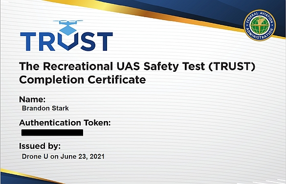

# The Recreational UAS Safety Test {#ch-TRUST}

Starting in June 2021, all recreational flyers must pass an aeronautical knowledge and safety test and provide proof of test passage (the TRUST completion certificate) to the FAA or law enforcement (including campus police) upon request. The test is free for everyone and takes 20-30 minutes to complete.

You may take The Recreational UAS Safety Test at any of the administrators found on the FAA's website:
https://www.faa.gov/uas/recreational_fliers/knowledge_test_updates/

The TRUST is divided into two sections:

- The first section provides you with the information needed to pass the test.
- The second section is a series of multiple choice questions. You cannot fail the test. If you answer a question incorrectly you will be provided with information on why the answer you chose was incorrect and will be promoted to try again.

Upon completion of the TRUST you will receive a completion certificate. The certificate never expires however if you lose your certificate you will need to re-take the test and obtain a new certificate. Neither the test administrator, nor the FAA, will maintain personally identifiable information about the recreational flyer so it is not possible to re-print or re-issue your original certificate.  We recommend uploading your certificate to UC Drones so that you have a backup copy available.

## What is TRUST?
TRUST is The Recreational UAS Safety Test. It provides education and testing for recreational flyers on important safety and regulatory information. If you fly your drone recreationally under the Exception for Recreational Flyers you must pass the test before you fly - this includes both recreational use and certain academic use-cases.

## How Can I Take the TRUST
You may take the free online test through any of the approved test administrators listed on the FAA's website here: https://www.faa.gov/uas/recreational_fliers/knowledge_test_updates/. After you complete the TRUST, you will be given the option to download your TRUST certificate and write down your Authentication Token.  We recommend uploading your TRUST certificate and entering your Authentication Token into your pilot profile within UC Drones.

## Who made the TRUST?
The FAA provides education and testing content to FAA Approved Test Administrators of TRUST, who in turn provide the content to recreational flyers for free.

## What does the TRUST certificate look like?
```{r,echo=FALSE, out.width='50%', fig.asp=.75, fig.align='center'}

```